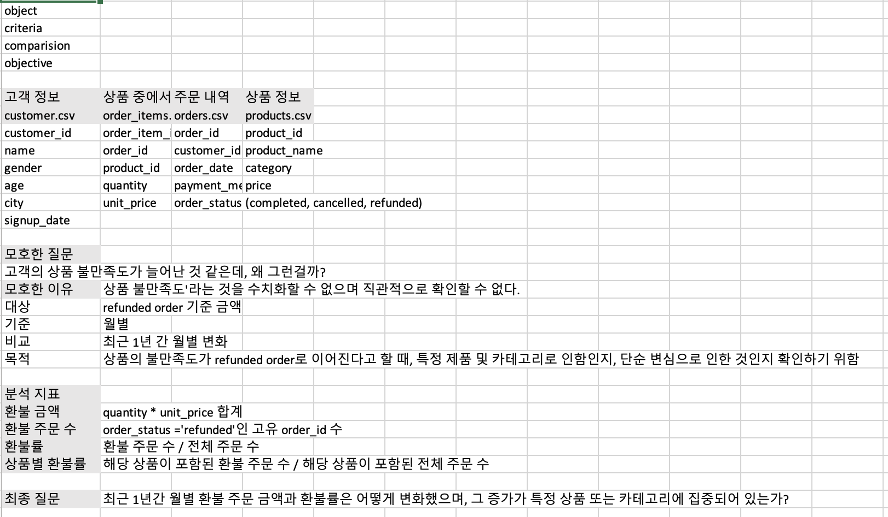
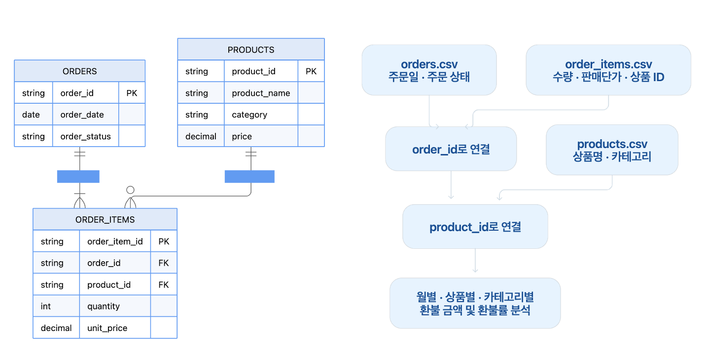
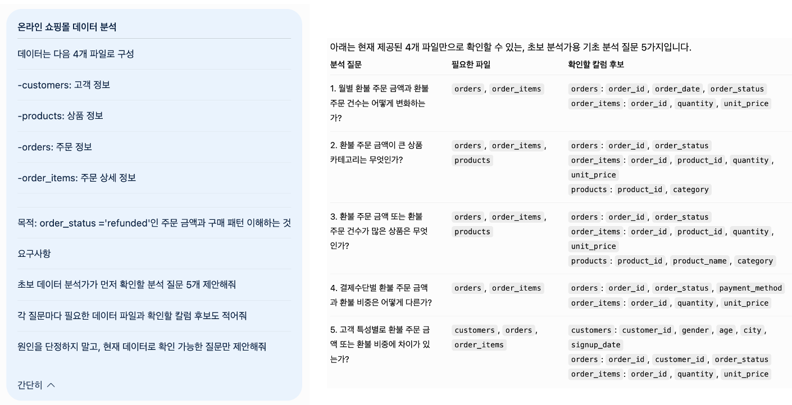
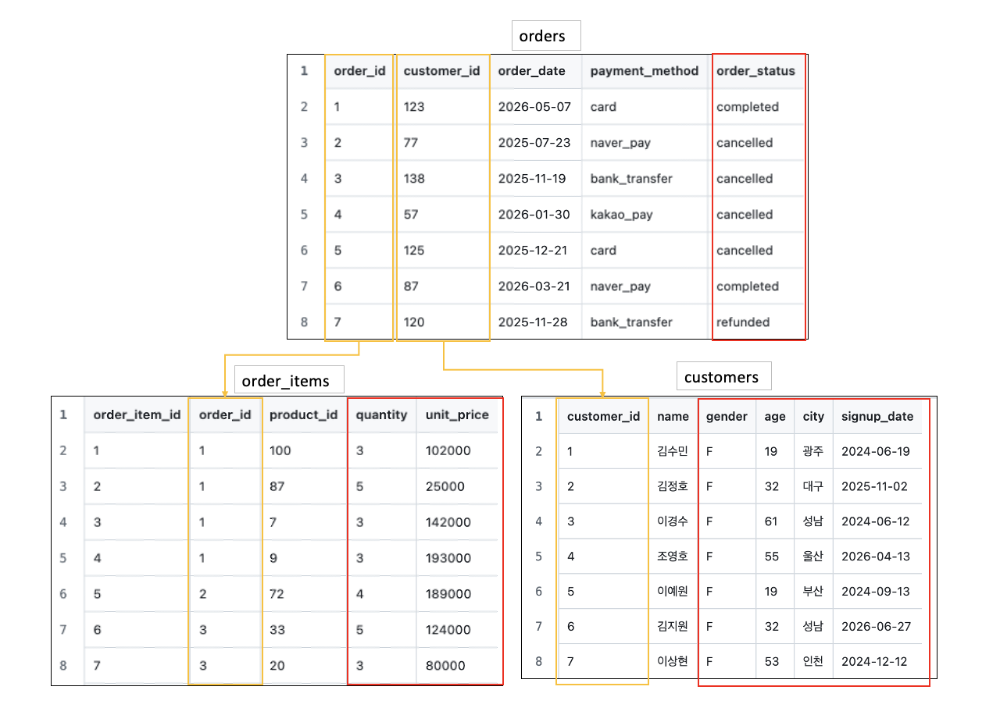
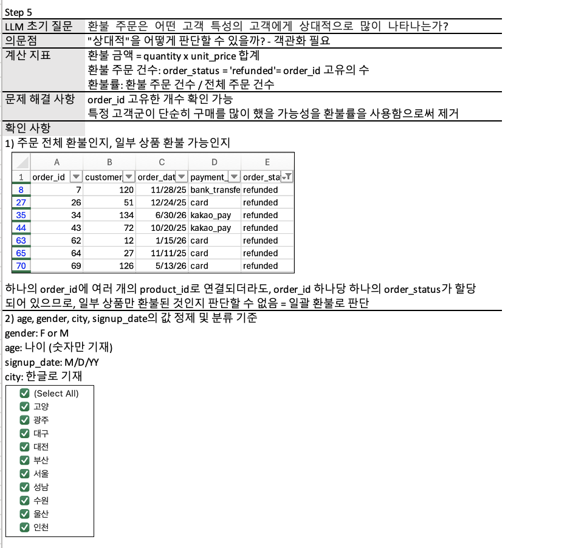
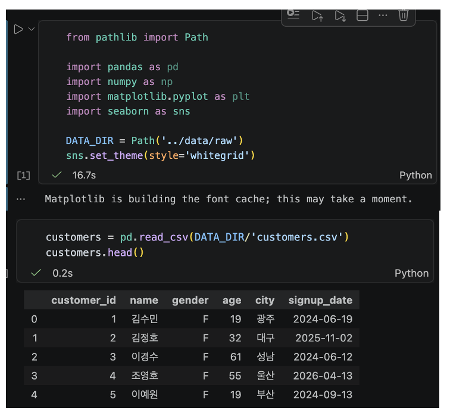

# Chapter 01 제출 답안. AI와 함께하는 데이터 분석의 시작

> 이 파일은 Chapter 01 실습 결과를 정리하여 제출하기 위한 학생용 템플릿입니다.  
> 강사 저장소의 원본 템플릿을 직접 수정하지 말고, 자신의 PC에 복사한 뒤 작성합니다.

---

## 0. 제출 정보

- 이름: 전해린
- GitHub ID: Haerin03
- 개인 저장소명: `llm-data-analysis-study`
- 작성일: 2026.09.04
- 사용한 LLM: ChatGPT-5.6 Terra

### 최종 제출 URL

```/workspaces/llm-data-analysis-study/chapter01/chapter01.md```

---

## 1. 원래 업무 질문

### 내가 선택한 막연한 질문

```고객의 상품 불만족도가 늘어난 것 같은데, 왜 그런 걸까?```

### 왜 이 질문이 모호하다고 생각했는가?

- 대상: Refunded order 기준 금액
- 기간: 1년
- 기준: 월별
- 비교 방법: 최근 1년 간 월별 변화 
분석 지표
1) 환불 금액: order_status ='refunded'인 order_id를 가진 quantity * unit_price 합계
2) 환불 주문 수: order_status ='refunded'인 고유 order_id 수
3) 환불률: 환불 주문 수 / 전체 주문 수
4) 상품별 환불률: 해당 상품이 포함된 환불 주문 수 / 해당 상품이 포함된 전체 주문 수 
5) 카테고리별 환불률: 해당 카테고리가 포함된 환불 주문 수 / 해당 카테고리가 포함된 전체 주문 수 
- 분석 목적: 
'불만족'의 측정 기준이 명확하지 않고, 증가 여부를 판단할 기간, 단위, 비교 기준이 없다. 또한, 환불이 상품 불만족 때문인지, 단순 변심 때문인지 확인할 근거가 정의되지 않았다.

### 분석 가능한 질문으로 다시 작성

```최근 1년간 월별 환불 주문 금액과 환불률은 월별로 어떻게 변화했으며, 그 증가가 특정 상품 또는 카테고리에 집중되어 있는가?```

### 결과 관찰

이 단계에서 질문이 어떻게 구체화되었는지 작성하세요.

월별 환불 주문 금액, 환불 주문 수, 전체 주문 대비 환불률을 확인한다. 이후 카테고리별, 상품별 환불 금액 및 환불률을 비교해 환불 증가를 주도한 항목을 찾는다.

### 나의 해석과 판단

왜 이 질문이 실제 분석에 더 적합하다고 판단했는지 자신의 말로 작성하세요.

특정 상품과 카테고리의 환불률이 전체 평균보다 높고 최근 상승 폭도 크다면, 해당 상품의 품질 및 배송, 가격 대비 기대치 등의 문제를 의심할 수 있다. 반대로 전체 카테고리에서 비슷하게 변화한다면 계절성, 고객 구성의 변화, 단순 변심 등의 공통 요인을 검토할 수 있다.

### 업무·분석적 의미

이 질문에 답하면 어떤 의사결정이나 다음 분석에 도움이 될 수 있는지 작성하세요.

환불 증가가 집중된 상품과 카테고리를 우선 관리 대상으로 선정할 수 있다. 상품 품질 점검, 배송 및 교환 정책 점검, 이벤트 등의 실행 우선 순위를 결정하는 근거가 된다. 

### 한계와 추가 확인 사항

현재 질문만으로 알 수 없는 것은 무엇인지 작성하세요.

현재 데이터에는 환불 사유가 없으므로 '상품 불만족'과 '단순 변심'을 직접 구분할 수 없다. 환불 사유, 반품 접수일, 배송 지연 여부, 리뷰 데이터가 추가로 필요하다. 또한, 금액만 본다면 고가 상품의 영향이 커질 수 있으므로 환불률도 함께 확인해야 한다.

### Evidence



---

## 2. 질문과 필요한 데이터 연결

### 필요한 데이터 파일

- [ ] `customers.csv`
- [O] `products.csv`
- [O] `orders.csv`
- [O] `order_items.csv`

### 필요한 컬럼 후보

| 파일 | 필요한 컬럼 | 필요한 이유 |

| orders.csv | order_id, order_date, order_status | 환불된 주문들을 확인해야 함 |

| order_items.csv | order_id, product_id, quantity, unit_price | 환불된 상품의 금액과 주문 수를 확인해야 함|

| products.csv | product_id, product_name, category | 상품별, 카테고리별 환불률을 확인해야 함 |

### 데이터 연결 관계

```1) orders.order_id ↔ order_items.order_id 로 주문 상태 및 주문일, 상품별 주문 항목 연결```
```2) order_items.product_id ↔ products.product_id로 상품명, 카테고리 연결```

### 결과 관찰

질문에 답하기 위해 어떤 데이터가 필요하다는 사실을 확인했는지 작성하세요.

주문 관련 데이터과 상품 관련 데이터를 id로 서로 연결시켜, 분석 지표를 계산하기 위해 필요한 필요한 price, quantity, category 등을 얻을 수 있다. 
따라서, 분석에 사용할 파생 칼럼은 다음과 같다. 
1) refund_amount = quantity × unit_price
2) order_month = order_date에서 연·월 추출
3) is_refunded = order_status = 'refunded' 여부

### 나의 해석과 판단

현재 데이터만으로 질문에 답할 수 있는지 판단하세요.

최근 1년의 월별 환불 금액, 환불 건수, 환불률 변화와 환불 증가가 특정 상품 및 카테고리에 집중되는지를 확인할 수 있다.

### 업무·분석적 의미

질문과 데이터 구조를 먼저 연결하는 것이 왜 중요한지 작성하세요.

분석에 필요한 정보가 어떤 파일과 칼럼에 있는지 명확히 하여 불필요한 데이터를 사용하거나 잘못된 기준으로 결과를 해석하는 일을 줄일 수 있다. 또한, 현재 데이터만으로 확인 가능한 범위와 한계를 미리 판단할 수 있다. 현재 부족한 데이터와 추가적으로 확인해야 하는 데이터를 인식할 수 있다. 

### 한계와 추가 확인 사항

실제 컬럼 존재 여부, 타입, 결측 등 아직 확인하지 못한 부분을 작성하세요.

각 파일의 데이터 타입을 확인해야 한다. order_date의 날짜 형식, order_status의 대소문자, quantity와 unit_price의 결측치 및 음수 여부를 확인해야 한다. 

### Evidence

필요한 경우 관계도 또는 데이터 파일 확인 화면을 첨부하세요.



---

## 3. LLM에게 분석 질문 후보 요청

### 사용 목적

```목적에 따라 분석할 수 있는 사항을 추가적으로 확인할 수 있고, 객관적으로 목적을 달성하기 위해 필요한 칼럼 및 파일을 확인할 수 있다.```

### 사용한 Prompt

```온라인 쇼핑몰 데이터 분석```
```데이터는 다음 4개 파일로 구성```
```-customers: 고객 정보```
```-products: 상품 정보```
```-orders: 주문 정보```
```-order_items: 주문 상세 정보```

```목적: order_status ='refunded'인 주문 금액과 구매 패턴 이해하는 것```
```요구사항```
```초보 데이터 분석가가 먼저 확인할 분석 질문 5개 제안해줘```
```각 질문마다 필요한 데이터 파일과 확인할 칼럼 후보도 적어줘```
```원인을 단정하지 말고, 현재 데이터로 확인 가능한 질문만 제안해줘```

### LLM 답변 요약

LLM의 전체 답변을 그대로 복사하지 말고 핵심 제안 3~5개를 요약하세요.

1. 상품별 전체 주문 대비 환불 비중이 높은 상품은 무엇인가?
2. 환불 주문은 어떤 결제수단에서 많이 발생하는가?
3. 환불 주문은 어떤 고객 특성의 고객에게 상대적으로 많이 나타나는가?

### 결과 관찰

LLM이 어떤 방향의 질문을 주로 제안했는지 사실 위주로 작성하세요.

LLM은 환불 주문을 중심으로 상품/카테고리, 결제수단, 고객 특성 등 여러 기준에서 비교하는 질문을 제안했다. 4가지 파일을 최대한 모두 활용할 수 있는 방향으로 질문이 구성되었다.

### 나의 해석과 판단

좋았던 제안과 그대로 사용하기 어려운 제안을 구분해서 작성하세요.

상품별 전체 주문 대비 환불 비중이 높은 상품을 확인하는 질문은 사전에 내가 구축한 기준과 동일하며 활용하기 좋다. 전체 주문 대비 환불 비중을 함께 확인함으로써 상대적으로 환불이 높은 상품을 찾을 수 있다.
결제 수단별 환불 현황도 현재 데이터만으로 확인 가능한 비교항목이므로 활용할 수 있다. 다만 결제 수단 자체가 환불의 원인이라고 해석하기보다는 결제 수단에 따라 환불 현상에 차이가 있는지를 확인하는 수준으로 사용해야 한다.
고객 특성별 환불 현황은 분석 범위를 넓히는 데 효과적이지만, 우선순위는 낮을 수 있다. 환불 증가가 어떤 상품과 카테고리에서 발생하는지 확인한 후 필요할 때 고객 특성 분석으로 확장할 수 있을 것이다. 

### 업무·분석적 의미

LLM이 분석 시작 단계에서 어떤 도움을 줄 수 있다고 생각하는지 작성하세요.

LLM은 분석 목적을 실제 확인 가능한 질문으로 나누고, 각 질문에 필요한 파일과 칼럼을 빠르게 정리하는 데 도움을 줄 수 있다. 또한, 데이터 구조를 모두 파악하기 전 분석의 출발점과 데이터 연결 방향을 설정할 수 있다. 또한, 분석 범위를 상품, 주문, 고객 등 여러 관점으로 확장할 수 있도록 후보를 제시하므로 업무 목적에 맞는 분석 우선순위를 정하는 데 활용할 수 있다. 

### 한계와 추가 확인 사항

LLM 답변에서 실제 데이터로 검증해야 할 내용을 작성하세요.

LLM의 제안은 제공된 파일에 해당 칼럼이 존재한다는 가정에 기반하므로, 분석 전 실제 데이터의 칼럼명과 데이터 타입을 확인해야 한다. 

### Evidence



---

## 4. LLM 제안 검증

LLM 제안 중 하나 이상을 선택해 검토합니다.

| 검증 항목 | 확인 내용 |

| 선택한 LLM 제안 | 환불 주문은 어떤 고객 특성의 고객에게 상대적으로 많이 나타나는가? |

| 필요한 파일 | customers, orders, order_items |

| 필요한 컬럼 | customers: customer_id, gender, age, city, signup_date
orders: order_id, customer_id, order_status
order_items: order_id, quantity, unit_price|

| 계산 범위 | 환불 금액 = quantity x unit_price 합계
환불 주문 건수: order_status = 'refunded'= order_id 수
환불률: 환불 주문 건수 / 전체 주문 건수 |

| 실제 데이터 확인 필요 여부 | 고객별 특성에 관한 칼럼인 gender, age, city, signup_date의 데이터 타입을 확인하여 분류 시 오류가 나타나지 않도록 확인해야 함 |

| 원인 단정 여부 | 다양한 측면(시간의 흐름에 다른 환불액 변화, 카테고리 및 상품, 결제수단, 고객 정보)에서 기준을 세워 질문을 생성한 것으로 보아 특정 원인을 단정하여 판단했다고 볼 수 없다. 제시된 정보 내에서 생성할 수 있는 다양한 방향의 원인을 가정하고 있다.|

| 최종 판단 | 수정 후 사용 |

### 내가 수정한 내용

"상대적으로 많이 나타나는가"를 더 명확히 판단할 수 있도록 고객 특성별 환불 금액, 건수뿐만 아니라 환불률을 비교하는 방식으로 수정하고자 한다. 

```고객의 특성에 따라 환불률이 어떻게 나타나는가?```

### 결과 관찰

검증 과정에서 확인된 사실을 작성하세요.

고객 특성을 가진 customers, 주문 상태를 가진 orders, 환불 금액 계산을 위한 수량과 단가를 가진 order_items를 이용해야 한다. 세 파일은 customer_id와 order_id를 기준으로 연결한다.
order_items에는 한 주문의 여러 상품 항목이 존재할 수 있으므로, 주문 건수를 계산할 때 order_id가 중복될 수 있다. 따라서 환불 주문 건수와 전체 주문 건수는 중복을 제거한 고유 order_id를 기준으로 계산해야 한다.

### 나의 해석과 판단

왜 `사용 / 수정 후 사용 / 보류` 중 해당 결정을 내렸는지 작성하세요.

수정 후 사용으로 결정한다. 고객 성별, 연령, 지역, 가입 시점별 환불 현황은 현재 데이터 구조에서 비교할 수 있는 질문이다. 그러나 특정 집단의 환불 금액만 비교하면 주문 수가 많은 집단이 크게 나타날 수 있으므로, 집단별 전체 주문 수를 반영한 환불률 비교가 필요하다. 기존의 질문은 특정 고객 특성에서 환불이 상대적으로 많이 나타나는지를 확인할 수 있지만, 그 고객 특성이 환불을 발생시켰다는 원인은 설명하지 못한다.

### 업무·분석적 의미

LLM 제안을 검증하지 않고 바로 사용하는 경우 어떤 문제가 생길 수 있는지 작성하세요.

필요한 파일의 연결 기준이나 계산 단위, 데이터 타입을 잘못 설정할 수 있다. 예를 들어 order_items 데이터를 결합한 후 order_id를 그대로 카운트하면 한 주문이 여러 번 집계되어 환불 건수가 과대하게 계산될 수 있다.
또한, 환불 금액만으로 특정 고객의 환불이 많다고 판단하면, 실제로는 해당 집단의 주문량이 많아서 나타난 결과일 수 있다. 따라서 분석 질문에 맞는 지표와 분모를 먼저 검토해야 올바르게 해석할 수 있다.

### 한계와 추가 확인 사항

아직 실제 데이터로 검증하지 못한 부분을 명확히 작성하세요.

- gender, age, city, signup_date의 실제 데이터 타입, 결측치 값의 표기 방식
- age에 따른 연령대 구간 설정 방식
- customer_id, order_id의 중복 및 누락 여부
- 주문 단위 전체 환불인지, 일부 상품만 환불될 수 있는 구조인지 여부 판단

### Evidence



---

## 5. Prompt Log

- 사용 목적: 환불 주문 금액과 구매 패턴을 분석하기 위한 초기 분석 질문을 도출하기 위함
- 입력 Prompt 요약: customers, products, orders, order_items 파일을 기준으로, order_status = 'refunded'인 주문 금액과 구매 패턴을 이해하기 위한 분석 질문 5개와 각 질문에 필요한 파일·컬럼을 요청함. 원인을 단정하지 않고 현재 데이터로 확인 가능한 질문만 제안하도록 조건을 설정함.
- LLM 답변 요약: 월별 환불 추이, 상품·카테고리별 환불 현황, 상품별 환불 비중, 결제수단별 환불 현황, 고객 특성별 환불 현황을 분석 질문으로 제안함. 또한 주문 상태·주문일은 orders, 수량·판매단가는 order_items, 고객 특성은 customers, 상품 분류는 products에서 확인하도록 안내함.
- 실제 반영 여부: 고객 특성별 환불 주문 현황 분석 질문을 선택해 수정 후 사용함
- 사람이 검증한 항목: 
1) customer_id, order_id를 기준으로 파일 연결 가능한지
2) 환불 주문 건수 계산 시 고유 order_id 기준으로 중복 제거가 필요한지
3) 고객 특성별 비교에는 환불 금액뿐 아니라 환불률이 필요한지
- 사람이 수정한 내용: "환불 주문은 어떤 특성의 고객에게 상대적으로 많이 나타나는가?"라는 질문에 맞게 고객 특성별 환불률을 비교하도록 보완함. 또한, 환불 주문 건수와 전체 주문 건수는 중복되지 않은 고유 order_id로 계산하도록 수정함.
- 남은 확인 사항: 
1) 주문 전체 환불인지, 일부 상품 환불도 가능한지
2) age, gender, city, signup_date의 값 정제 및 분류 기준
3) 환불 사유, 배송, 리뷰 등의 데이터 추가 확보 가능 여부

### 결과 관찰

LLM 사용 기록에서 어떤 의사결정 과정을 확인할 수 있는지 작성하세요.

LLM 사용 기록을 통해 분석 과정이 "업무 목적 설정 → 분석 질문 제안 → 필요 데이터와 컬럼 확인 → 계산 기준 검토 → 사람이 수정·판단"의 순서로 진행되었음을 확인할 수 있다. 특히 LLM이 분석 후보를 넓게 제안했고, 최종 질문과 계산 방식은 사람이 데이터 구조와 분석 목적에 맞추어 검증 및 수정했다는 의사결정 과정을 남길 수 있다.

### 나의 해석과 판단

Prompt Log를 남기는 것이 왜 필요한지 자신의 말로 작성하세요.

Prompt Log는 LLM의 답변을 그대로 분석 결과로 사용하지 않았다는 근거다. 어떤 질문을 LLM에게 요청했고, 어떤 제안을 선택했으며 어떤 부분을 수정했는지 기록하면 분석 기준의 출처와 변경 이유를 나중에 다시 확인할 수 있다.
또한, 분석 결과에 오류나 해석 차이가 발생했을 때, 문제의 원인이 데이터 자체인지, LLM 제안인지, 사람이 정한 계산 기준인지 추적할 수 있다. 따라서 Prompt Log는 AI 활용 과정의 투명성을 높이고, 동일한 분석을 반복하거나 다른 사람이 검토할 때 일관성을 유지하는 데 필요하다.

### Evidence



---

## 6. 개인정보와 Secret 보호 확인

다음 항목을 확인합니다.

- [O] 실제 이름·이메일·전화번호 등 고객 개인정보를 Prompt에 사용하지 않았습니다.
- [O] API Key를 코드나 Notebook에 직접 작성하지 않았습니다.
- [O] `.env` 실제 내용을 캡처하거나 업로드하지 않았습니다.
- [O] GitHub Token, 비밀번호, 내부 URL이 캡처에 보이지 않습니다.
- [O] 제출 전 이미지까지 다시 확인했습니다.

### 나의 판단

이번 실습에서 어떤 정보는 LLM 또는 Public GitHub에 올리면 안 된다고 판단했는지 작성하세요.

고객의 실제 이름, 이메일 주소, 전화번호, 상세 주소처럼 개인을 식별할 수 있는 개인정보를 올리면 안 된다. 고객 ID도 다른 정보와 결합하면 개인을 식별할 가능성이 있기 때문에 분석 예시나 화면 캡처에서는 그대로 노출하지 않거나 익명화된 값만 사용해야 한다.
Prompt에는 데이터 구조와 익명화된 예시만 사용하고, 제출 전에는 코드, Notebook, 이미지에 민감 정보가 포함되지 않았는지 다시 확인해야 한다.

---

## 7. Chapter 01 Notebook 확인

Notebook:

```notebooks/ch01_ai_data_analysis_intro.ipynb```

### 내 환경 상태

- [ ] 아직 환경설정 전이라 Notebook 위치만 확인했습니다.
- [O] 환경설정이 완료되어 Notebook을 직접 실행했습니다.

### 환경설정 완료 학생만 작성

#### 실행한 코드

```python
from pathlib import Path

import pandas as pd
import numpy as np
import matplotlib.pyplot as plt
import seaborn as sns

DATA_DIR = Path('../data/raw')
sns.set_theme(style='whitegrid')
```

#### 실행 결과

```Matplotlib is building the font cache; this may take a moment.```

#### 결과 관찰

실행 결과에서 확인한 사실을 작성하세요.

Path, pandas, numpy, matplotlib, seaborn 라이브러리를 오류 없이 불러왔고, 그래프 스타일도 whitegrid로 설정되었다. Matplotlib is building the font cache 메시지는 오류가 아니라 Matplotlib가 처음 실행될 때 글꼴 정보를 준비하는 과정에서 나타나는 정상 메시지이다. 또한 DATA_DIR는 분석에 사용할 CSV 파일이 저장된 data/raw 폴더의 경로를 지정하기 위한 변수이다.

#### 나의 해석과 판단

현재 Notebook이 본격 분석이 아니라 starter scaffold라는 의미를 자신의 말로 설명하세요.

현재 Notebook은 데이터를 바로 분석하는 완성된 분석 파일이 아니라, 이후 분석에 필요한 라이브러리와 데이터 폴더 경로를 미리 설정해 둔 starter scaffold라고 판단했다. 즉, pandas를 이용해 CSV를 읽고, matplotlib·seaborn으로 시각화하며, DATA_DIR를 통해 여러 데이터 파일을 일관된 경로에서 불러올 수 있도록 기본 구조를 만든 상태이다. 이후 데이터 파일을 불러와 구조와 품질을 확인한 뒤 실제 분석을 진행해야 한다.

#### 한계와 추가 확인 사항

Chapter 02 또는 Chapter 03에서 추가로 확인해야 할 내용을 작성하세요.

현재 DATA_DIR = Path('../data/raw')는 Notebook이 notebooks 폴더에 위치한다는 구조를 기준으로 한 상대 경로이므로, 실제 Notebook의 실행 위치와 데이터 폴더 위치가 일치하는지 확인해야 한다. 현재 프로젝트 구조에서는 Path('data/raw')가 필요하다.

#### Evidence



> 환경설정 전이라면 이 이미지는 생략할 수 있습니다.

---

## 8. Chapter 01 최종 해석

### 이번 장에서 가장 중요하다고 생각한 내용

```막연한 업무 질문을 바로 분석하지 않고, 분석 대상, 기준, 비교, 목적을 먼저 구체화하는 과정이 중요하다고 생각했다. 질문이 명확해야 필요한 파일과 칼럼, 계산 지표를 올바르게 선택할 수 있다. LLM은 분석 질문과 데이터 활용 방향을 빠르게 제안하는 데 도움이 되지만, 실제 데이터 구조와 계산 기준은 사람이 확인해야 한다. 특히 분석 결과와 원인을 구분하여 해석한다. ```

### LLM을 데이터 분석에 사용할 때 가장 조심해야 할 점

```LLM이 제안한 내용이 실제 데이터의 칼럼명, 데이터 타입, 값의 의미와 일치하는지 검증하지 않고 그대로 사용하면 안 된다.```
```또한, LLM은 데이터에 없는 정보까지 추측할 수 있으므로, 상품 불만족이나 특정 고객 특성이 원인이라고 단정해서는 안 된다.```
```개인정보 등 민감 정보가 Prompt에 포함되지 않도록```

### 사람과 LLM의 역할 차이

| 항목 | LLM이 도울 수 있는 부분 | 사람이 책임져야 하는 부분 |
| --- | --- | --- |
| 질문 정의 | 업무 목적을 분석 가능한 질문으로 바꾸는 예시 제안 | 실제 업무 목적에 맞는 질문 선정 및 분석 범위 결정 |
| 데이터 확인 | 필요한 파일, 칼럼 후보와 점검 항목 제안 | 실제 칼럼, 데이터 타입, 결측치, 중복, 연결 가능 여부 확인 |
| 코드 작성 | 데이터 불러오기, 집계 코드 초안 작성 | 코드 실행, 오류 수정, 계산 방식과 결과의 정확성 검증 |
| 결과 해석 | 결과를 읽는 관점과 추가 분석 아이디어 제안 | 결과가 의미하는 범위 판단, 원인 단정 방지 |
| 최종 판단 | 판단에 필요한 비교 기준과 선택지 제안 | 업무 실행 여부와 우선순위에 대한 최종 의사결정 |

### 다음 Chapter에서 확인하고 싶은 것

```Chapter 02에서는 .venv 가상환경을 만들고, VS Code의 Python 인터프리터와 Jupyter Notebook 커널을 같은 가상환경으로 연결하는 방법을 확인하고 싶다. 또한 requirements.txt를 이용해 필요한 라이브러리를 설치하고, 현재 실행 중인 Python 경로를 확인하는 방법을 익히고 싶다. 
Chapter 03에서는 실제 CSV 파일을 불러온 뒤 컬럼, 데이터 타입, 결측치, 중복값, 파일 간 ID 연결 상태를 점검해 보고 싶다.
```

---

## 9. 최종 제출 체크리스트

- [O] 원래 업무 질문과 구체화한 분석 질문을 작성했습니다.
- [O] 질문에 필요한 데이터 파일과 컬럼 후보를 정리했습니다.
- [O] LLM Prompt와 답변 요약을 작성했습니다.
- [O] LLM 제안을 실제 데이터 관점에서 검증했습니다.
- [O] 각 핵심 STEP의 결과 관찰을 작성했습니다.
- [O] 각 핵심 STEP의 나의 해석과 판단을 작성했습니다.
- [O] 업무·분석적 의미를 작성했습니다.
- [O] 한계와 추가 확인 사항을 작성했습니다.
- [O] 핵심 실행 Evidence 이미지를 첨부했습니다.
- [O] 이미지가 Markdown에서 정상 표시됩니다.
- [O] 개인정보가 없습니다.
- [O] API Key·Secret·Token이 없습니다.
- [O] 개인 GitHub 저장소에 업로드했습니다.
- [O] GitHub에서 Markdown과 이미지가 정상 표시됩니다.
- [O] 아래 최종 파일 URL이 정상적으로 열립니다.

### 최종 파일 URL

```https://github.com/Haerin03/llm-data-analysis-study/blob/main/chapter01/chapter01.md```

---

## 10. 교수자 확인용 요약

### 수행 상태

- [O] COMPLETE
- [ ] PARTIAL

### 내가 가장 중요하게 내린 판단 1개

```고객 특성별 환불 현황을 비교할 때 환불 금액이나 환불 건수만 보지 않고, 각 고객 특성 집단의 전체 주문 수를 반영한 환불률을 함께 계산해야 한다고 판단했다.```

### 아직 확인이 필요한 내용 1개

```실제 데이터에서 order_id가 주문 상세 데이터에서 중복되는 구조인지와, 주문 전체 환불만 가능한지 또는 일부 상품 환불도 가능한지를 확인해야 한다.```