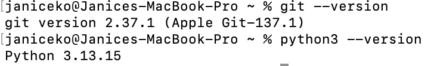
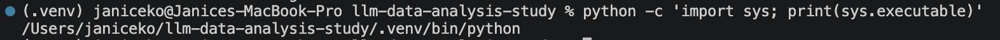
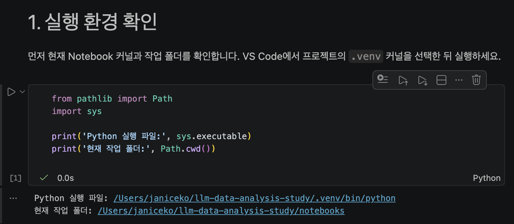
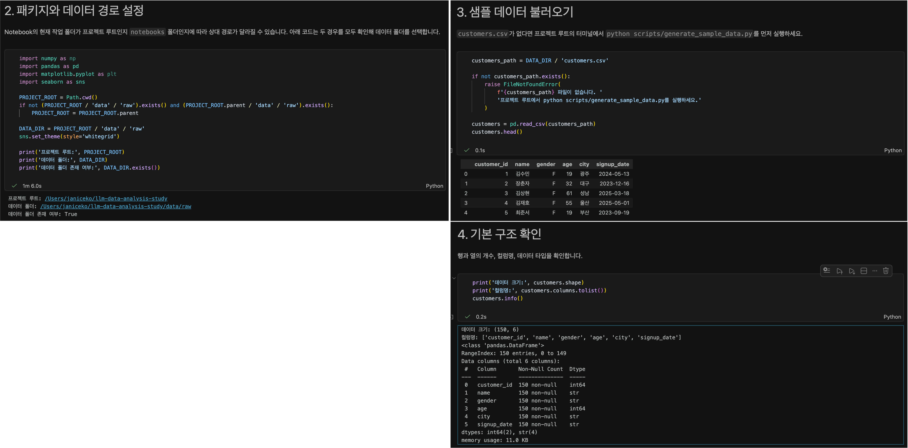
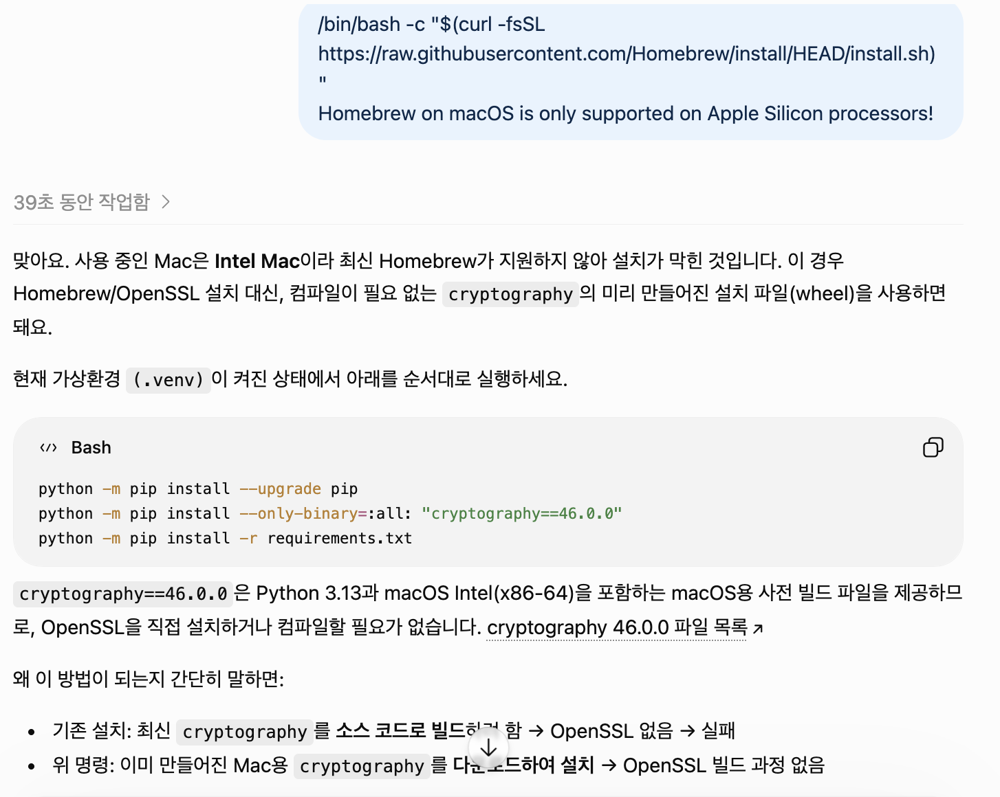

# Chapter 02 제출 답안. VS Code에서 시작하는 데이터 분석 환경

> 최종 파일은 개인 GitHub 저장소의 `chapter02/chapter02.md`로 저장하는 것을 권장합니다.

## 0. 제출 정보

- 이름: 전해린
- GitHub ID: Haerin03
- 개인 저장소: `llm-data-analysis-study`
- 작성일: 2026.09.12
- 운영체제: MAC OS

### 최종 제출 URL

```https://github.com/Haerin03/llm-data-analysis-study/blob/main/chapter02/chapter02.md```

---

## 1. Python과 Git 환경 확인

### 실행 내용

```python3 --version```

```git --version```

### 실행 결과

```Python 3.13.15```

```git version 2.37.1 (Apple Git-137.1)```

### Evidence



### 결과 관찰

버전과 실행 가능 여부를 사실 위주로 작성하세요.

python3 --version 명령어를 실행한 결과, Python 3.13.15가 설치되어 있으며 정상적으로 실행되는 것을 확인했다. 또한, git --version 명령어의 실행 결과는 git version 2.37.1 (Apple Git-137.1)로, Git도 설치되어 정상적으로 실행 가능한 상태임을 확인했다. 

### 나의 해석과 판단

현재 환경이 수업 실습에 적합한지 판단하고 이유를 작성하세요.

현재 환경은 Python과 Git이 모두 정상적으로 설치되어 있어 수업 실습을 진행하기에 기본적으로 적합하다. Python 3.13.15는 최신 버전의 Python 환경이며, 데이터 분석 실습에 필요한 라이브러리를 설치하고 코드를 실행할 수 있다. 
Git도 설치되어 있어 프로젝트 파일의 변경 이력을 관리하거나 수업 자료를 내려받는 작업이 가능하다.

### 업무·분석적 의미

프로젝트 시작 전에 버전과 도구 상태를 확인하는 이유를 작성하세요.

프로젝트를 시작하기 전에 Python과 Git의 버전 및 실행 상태를 확인하면, 이후 코드 실행이나 패키지 설치 과정에서 발생할 수 있는 환경 문제를 미리 발견할 수 있다. 특히 팀 프로젝트나 동일한 실습 자료를 여러 사람이 사용할 때 도구 버전 차이로 인한 오류를 줄이고, 분석 결과를 재현하기 쉬운 환경을 만드는 데 도움이 된다.

### 한계와 추가 확인 사항

아직 확인하지 못한 항목을 작성하세요.

현재는 Python과 Git의 설치 및 기본 실행 여부만 확인하였다. 앞으로는 pandas, numpy, matplotlib, seaborn 등 수업에서 사용할 데이터 분석 라이브러리가 설치되어 있는지 확인해야 한다. 또한 Jupyter Notebook 또는 VS Code에서 Python 인터프리터가 올바르게 연결되는지, 실습 데이터 파일을 정상적으로 불러올 수 있는지도 추가로 확인할 필요가 있다.

---

## 2. 저장소와 `.venv` 준비

### 수행 내용

- [O] 공식 Public 저장소 clone
- [O] 프로젝트 루트 확인
- [O] `.venv` 생성
- [O] `.venv` 활성화
- [O] `requirements.txt` 설치

### 핵심 실행 결과

```현재 프로젝트 경로: janiceko@Janices-MacBook-Pro llm-data-analysis-study
터미널 Python 실행 파일: /Users/janiceko/llm-data-analysis-study/.venv/bin/python
가상환경 활성화 여부: (.venv) janiceko@Janices-MacBook-Pro llm-data-analysis-study
패키지 설치 결과: 완료
```

### Evidence



### 결과 관찰

현재 `python`이 어떤 실행 파일을 가리키는지 작성하세요.

현재 python 명령어는 시스템 Python이 아니라 프로젝트 내부 가상환경의 실행 파일인 /Users/janiceko/llm-data-analysis-study/.venv/bin/python을 가리킨다. 또한 터미널 앞에 (.venv)가 표시되어 가상환경이 정상적으로 활성화된 상태임을 확인하였다.

### 나의 해석과 판단

시스템 Python과 프로젝트 `.venv`를 분리하는 것이 왜 필요한지 자신의 말로 작성하세요.

시스템 Python과 프로젝트별 .venv를 분리하면, 프로젝트에 필요한 패키지와 버전을 다른 프로젝트 또는 Mac 기본 환경에 영향을 주지 않고 관리할 수 있다. 예를 들어 한 프로젝트에서 사용하는 pandas나 jupyter의 버전이 다른 프로젝트의 패키지 버전과 달라도 충돌을 줄일 수 있다. 따라서 실습과 분석 작업은 프로젝트 전용 가상환경에서 진행하는 것이 안정적이라고 판단하였다.

### 업무·분석적 의미

다른 사람이 같은 프로젝트를 재실행할 때 가상환경이 주는 이점을 작성하세요.

다른 사람이 동일한 저장소를 내려받은 뒤 requirements.txt를 이용해 패키지를 설치하면, 각자의 컴퓨터에서도 비슷한 라이브러리 환경을 구성할 수 있다. 이로써 같은 코드와 데이터를 실행했을 때 결과가 달라질 가능성을 줄이고, 분석 과정의 재현성과 협업 효율을 높일 수 있다.

### 한계와 추가 확인 사항

회사/기관 PC 정책, Python 버전 차이 등 현재 환경의 제약을 작성하세요.

현재 환경은 개인 Mac의 Intel 프로세서와 Python 3.13.15를 기준으로 구성되어 있다. 회사나 기관 PC에서는 프로그램 설치 권한, 보안 정책, 인터넷 접근 제한 등으로 인해 가상환경 생성이나 패키지 설치가 제한될 수 있다. 또한 운영체제, CPU 종류, Python 버전이 다르면 일부 패키지가 바로 설치되지 않거나 추가 도구가 필요할 수 있으므로, 다른 환경에서 실행할 때는 Python 버전과 패키지 설치 결과를 다시 확인해야 한다.

---

## 3. VS Code 인터프리터와 Jupyter 커널 연결

### 확인 결과

```VS Code Python 인터프리터: Python 3.13.15```

```Notebook sys.executable: /Users/janiceko/llm-data-analysis-study/.venv/bin/python```

```Notebook Path.cwd(): /Users/janiceko/llm-data-analysis-study/notebooks```

### Evidence



### 결과 관찰

터미널 Python과 Notebook Python이 같은 `.venv`인지 작성하세요.

VS Code에서 선택한 Python 인터프리터는 Python 3.13.15이며, Notebook에서 확인한 sys.executable의 경로는 /Users/janiceko/llm-data-analysis-study/.venv/bin/python이다. 
이는 앞서 터미널에서 확인한 프로젝트의 .venv Python 실행 파일 경로와 동일하다. 따라서 터미널과 Notebook은 같은 프로젝트 가상환경을 사용하고 있다.

### 나의 해석과 판단

둘이 다를 경우 어떤 문제가 발생할 수 있는지 작성하세요.

터미널과 Notebook이 서로 다른 Python 환경을 사용하면, 터미널에서는 설치된 패키지가 Notebook에서는 없다고 표시되거나 같은 코드라도 라이브러리 버전 차이로 결과가 달라질 수 있다. 현재는 두 환경이 동일한 .venv를 사용하므로, 터미널에서 설치한 패키지를 Notebook에서도 같은 버전으로 사용할 수 있어 실습 환경이 일관되게 구성되었다고 판단하였다.

### 업무·분석적 의미

`ModuleNotFoundError` 같은 환경 오류를 줄이는 데 어떤 도움이 되는지 작성하세요.

분석을 시작하기 전에 VS Code 인터프리터와 Notebook 커널이 같은 가상환경을 가리키는지 확인하면 ModuleNotFoundError와 같은 환경 오류를 줄일 수 있다. 예를 들어 pandas를 가상환경에 설치했는데 Notebook이 시스템 Python을 사용하면 패키지를 찾지 못할 수 있다. 실행 파일 경로를 확인하면 이러한 문제의 원인을 빠르게 구분하고 해결할 수 있다.

### 한계와 추가 확인 사항

커널 이름만 보고 판단하면 안 되는 이유 등 추가 확인 사항을 작성하세요.

커널 목록에 표시되는 이름만으로는 실제 Python 실행 경로를 정확히 판단할 수 없다. 이름이 같거나 비슷한 커널이 여러 개 존재할 수 있기 때문이다. 따라서 Notebook에서 sys.executable을 직접 실행하여 경로를 확인하는 것이 필요하다. 
또한 Notebook의 현재 작업 경로는 /Users/janiceko/llm-data-analysis-study/notebooks이므로, 데이터를 불러올 때 상대경로를 사용할 경우 이 위치를 기준으로 경로가 설정되는지도 추가로 확인해야 한다.

---

## 4. 샘플 데이터와 Notebook 실행 검증

### 확인 결과

```text
DATA_DIR 존재 여부: True
customers.csv 존재 여부: True
customers.shape: (150, 6)
주요 컬럼: 컬럼명: ['customer_id', 'name', 'gender', 'age', 'city', 'signup_date']
```

### Evidence



### 결과 관찰

`customers.head()`, shape, 컬럼 결과에서 직접 확인한 사실을 작성하세요.

DATA_DIR의 존재 여부가 True로 확인되어 프로젝트에서 지정한 데이터 폴더를 정상적으로 찾았다. customers.csv도 존재 여부가 True로 확인되었으며, customers.head()를 통해 고객 데이터의 처음 5개 행이 DataFrame 형태로 정상 출력되는 것을 확인하였다. 
데이터는 총 150행, 6개 열로 구성되어 있고, 열 이름은 customer_id, name, gender, age, city, signup_date이다.

### 나의 해석과 판단

이 단계까지 성공했다면 어떤 구성 요소가 정상 연결되었다고 판단할 수 있는지 작성하세요.

이 단계까지 성공했다는 것은 VS Code의 Notebook 커널, 프로젝트 가상환경, 상대경로 설정, pandas 라이브러리, 그리고 data/raw/customers.csv 파일이 정상적으로 연결되어 있음을 의미한다. 즉, 이후 분석 코드를 실행할 수 있는 기본 환경이 구성되었다고 판단하였다.

### 업무·분석적 의미

분석 전에 최소 스모크 테스트를 하는 이유를 작성하세요.

분석 전에 파일을 읽고 데이터의 행·열 수와 컬럼을 확인하는 최소 스모크 테스트를 수행하면, 본격적인 분석 전에 경로 오류, 파일 누락, 라이브러리 미설치, 잘못된 데이터 파일 선택 등의 문제를 빠르게 발견할 수 있다. 이를 통해 분석 중간에 발생하는 오류를 줄이고, 문제 발생 시 원인을 더 쉽게 구분할 수 있다.

### 한계와 추가 확인 사항

현재는 환경 연결만 확인했으며 데이터 품질은 아직 검증하지 않았다는 점을 작성하세요.

현재 단계에서는 데이터 파일을 정상적으로 불러올 수 있는지만 확인하였다. 결측치, 중복 행, 잘못된 자료형, 고객 ID의 중복 여부, age 값의 범위, signup_date의 날짜 형식 등 데이터 품질은 아직 검증하지 않았다. 따라서 본격적인 분석 전에는 데이터 품질 점검을 추가로 수행해야 한다.

---

## 5. 오류 해결 기록

실습 중 오류가 있었다면 작성합니다. 오류가 없었다면 `해당 없음`이라고 적습니다.

### 오류 메시지

```ERROR: Failed building wheel for cryptography Could not find openssl via pkg-config: The pkg-config command could not be found.```

### 원인 후보

1. requirements.txt 설치 과정에서 cryptography 패키지가 사전 빌드 파일이 아닌 소스 코드 방식으로 설치되려고 했다.
2. Intel Mac 환경에 OpenSSL 및 pkg-config 관련 도구가 설치되어 있지 않아 cryptography 빌드가 실패했다.
3. 최신 Homebrew는 해당 Intel Mac 환경에서 지원되지 않아, OpenSSL 설치를 위한 일반적인 Homebrew 방법을 바로 사용할 수 없었다.

### 내가 확인한 순서

1. python -m pip install -r requirements.txt 실행 결과에서 실제로 실패한 패키지와 마지막 오류 메시지를 확인하였다.
2. 오류 로그에서 cryptography 빌드 실패 및 OpenSSL, pkg-config 관련 메시지를 확인하였다.
3. Mac의 Intel 환경과 Homebrew 설치 제한을 확인하였다.
4. 소스 빌드 대신 macOS Intel과 Python 3.13에서 사용할 수 있는 사전 빌드 cryptography 패키지를 설치한 뒤, 전체 요구 패키지 설치를 다시 실행하였다.

### 해결 방법

```python -m pip install --upgrade pip```

```python -m pip install --only-binary=:all: "cryptography==46.0.0"```

```python -m pip install -r requirements.txt```

### Evidence



### 나의 해석과 판단

왜 해당 원인이 가장 가능성이 높다고 판단했는지 작성하세요.

오류 로그에 cryptography 패키지와 OpenSSL, pkg-config가 직접 표시되었고, 다른 주요 패키지는 이미 정상적으로 내려받고 있었다. 따라서 requirements.txt 전체의 문제라기보다 특정 하위 패키지의 소스 빌드 환경 문제라고 판단하였다. 사전 빌드 파일을 사용한 뒤 패키지 설치가 완료되었으므로, 해당 원인이 가장 가능성이 높다고 판단하였다.

### 한계와 추가 확인 사항

보안 정책 변경, 무분별한 삭제처럼 시도하지 않은 조치와 이유를 작성하세요.

오류 해결을 위해 프로젝트 폴더나 가상환경을 무분별하게 삭제하지 않았다. 또한 출처가 불분명한 설치 명령어를 사용하거나 시스템 보안 설정을 변경하지 않았다. 안전하게 문제를 해결하기 위해서는 오류 로그와 운영체제 환경을 먼저 확인해야 한다.

---

## 6. Secret 보호 확인

- [O] `.env`는 Git 추적 대상이 아닙니다.
- [O] 실제 API Key를 코드에 작성하지 않았습니다.
- [O] 캡처 화면에 Token/비밀번호가 없습니다.
- [O] `.venv`를 Git에 올리지 않습니다.

### Evidence

필요한 경우 `git status`, `.gitignore` 확인 화면을 첨부합니다.


### 나의 해석과 판단

환경 파일과 비밀정보를 분리해야 하는 이유를 작성하세요.

API Key, 비밀번호, 토큰 등의 비밀정보를 코드나 Git 저장소에 직접 작성하면 저장소를 공유하거나 공개할 때 정보가 유출될 수 있다. 따라서 비밀값은 .env 파일처럼 코드와 분리된 환경 파일에 보관하고, .gitignore에 등록하여 Git이 추적하지 않도록 관리해야 한다. 또한 .venv는 각 컴퓨터에서 다시 만들 수 있는 실행 환경이므로 저장소에 올리지 않고, requirements.txt를 통해 필요한 패키지 목록만 공유하는 것이 적절하다.

---

## 7. Chapter 02 최종 회고

### 가장 중요했다고 생각한 환경 설정 1가지

```VS Code의 Python 인터프리터와 Jupyter Notebook 커널을 프로젝트의 .venv로 동일하게 연결한 작업```

### 그 이유

```터미널, VS Code, Notebook이 서로 다른 Python 환경을 사용하면 패키지가 설치되어 있어도 Notebook에서 찾지 못하는 문제가 발생할 수 있다. 이번 실습에서 sys.executable 경로를 확인하여 모두 같은 .venv를 사용한다는 것을 검증했기 때문에, 이후 분석 코드를 일관된 환경에서 실행할 수 있게 되었다.```

### 다음 Chapter에서 재사용할 환경 체크 3가지

1. 터미널에서 (.venv)가 활성화되어 있고 which python이 프로젝트의 .venv/bin/python을 가리키는지 확인한다.
2. VS Code의 Python 인터프리터와 Notebook 커널이 프로젝트 .venv와 연결되어 있는지 sys.executable로 확인한다.
3. 데이터 경로와 파일 존재 여부를 확인하고, head(), shape, columns로 최소 스모크 테스트를 수행한다.

### 현재 환경의 한계 또는 주의점

```현재 환경은 Intel Mac과 Python 3.13.15를 기준으로 구성되어 있다. 운영체제, CPU 종류, Python 버전, 회사·기관의 보안 정책이 달라지면 일부 패키지 설치 방식이나 실행 결과가 달라질 수 있다. 또한 .env와 .venv가 실제로 Git 추적 대상이 아닌지는 제출 전에 git status와 .gitignore를 통해 다시 확인해야 한다.```

---

## 최종 제출 체크

- [O] 핵심 Evidence 4~7장을 첨부했습니다.
- [O] 단순 캡처가 아니라 관찰과 판단을 작성했습니다.
- [O] Secret/개인정보가 없습니다.
- [O] GitHub에서 이미지가 정상 표시됩니다.
- [O] 개인 저장소에 `chapter02/chapter02.md`를 업로드했습니다.
- [O] 저장소 URL이 아니라 최종 파일 URL을 제출합니다.