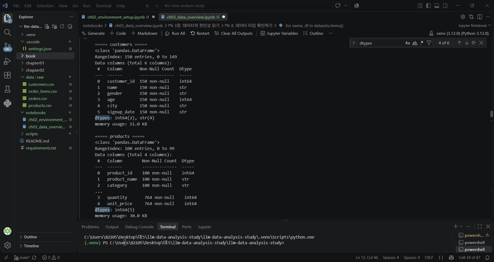
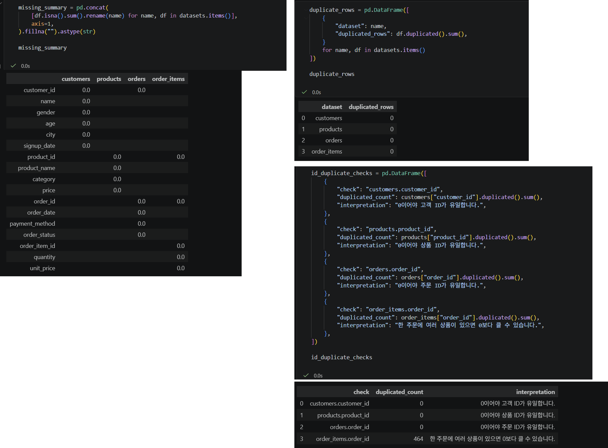
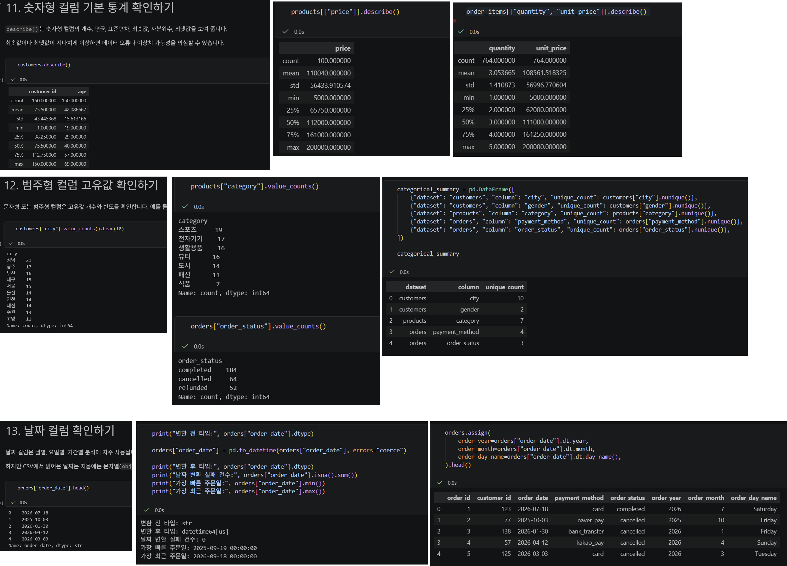
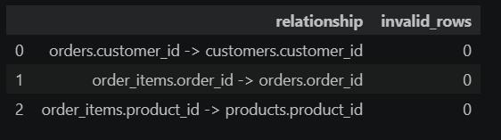
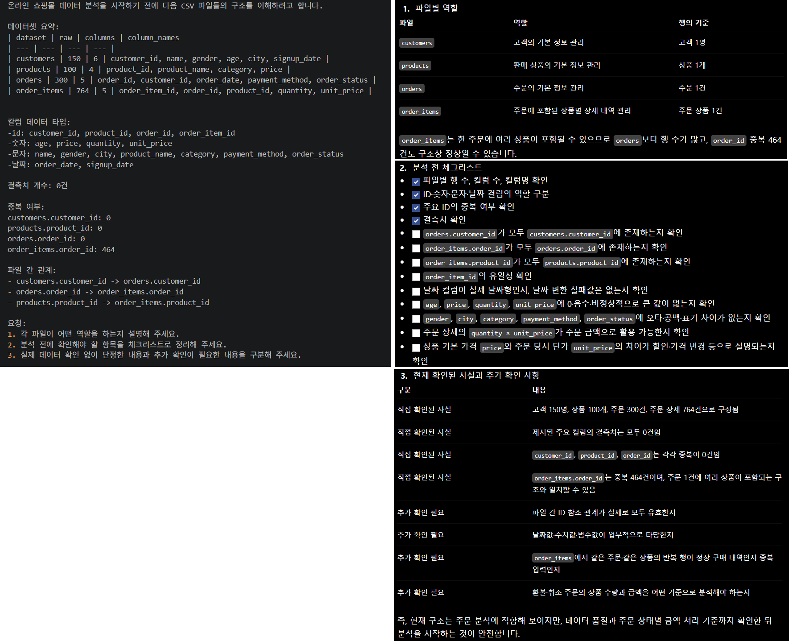

# Chapter 03 제출 답안 양식. 데이터의 첫인상 읽기

> 주 제출물은 실행 완료 Notebook `chapter03/chapter03.ipynb`입니다. 이 양식의 항목을 Notebook의 Markdown 셀로 추가해 작성합니다.

# chapter02 이후로 노트북을 변경하여 파일 경로가 변경되었습니다. Chapter02까지의 환경 설정은 완료하였습니다. 

## 0. 제출 정보
- 이름: 전해린
- GitHub ID: Haerin03
- 작성일: 2026.09.19
- 최종 제출 URL: https://github.com/Haerin03/llm-data-analysis-study/blob/main/chapter03/chapter03.ipynb

## 1. 데이터 로딩과 구조 확인
### 실행/결과
- 4개 CSV 로딩 여부: 4개 csv 모두 정상적으로 로드 확인
	file	path	exists
0	customers.csv	C:\Users\82105\Desktop\대5\llm-data-analysis-st...	True
1	products.csv	C:\Users\82105\Desktop\대5\llm-data-analysis-st...	True
2	orders.csv	C:\Users\82105\Desktop\대5\llm-data-analysis-st...	True
3	order_items.csv	C:\Users\82105\Desktop\대5\llm-data-analysis-st...	True

- 각 데이터 shape:
customers: (150, 6)
products: (100, 4)
orders: (300, 5)
order_items: (764, 5)

- 주요 컬럼:
[customers]
['customer_id', 'name', 'gender', 'age', 'city', 'signup_date']
[products]
['product_id', 'product_name', 'category', 'price']
[orders]
['order_id', 'customer_id', 'order_date', 'payment_method', 'order_status']
[order_items]
['order_item_id', 'order_id', 'product_id', 'quantity', 'unit_price']

- dtypes에서 주목한 컬럼:
	customers	products	orders	order_items
customer_id	int64		int64	
name	str			
gender	str			
age	int64			
city	str			
signup_date	str			
product_id		int64		int64
product_name		str		
category		str		
price		int64		
order_id			int64	int64
order_date			str	
payment_method			str	
order_status			str	
order_item_id				int64
quantity				int64
unit_price				int64

### Evidence

### 결과 관찰
직접 확인한 사실을 작성하세요.

고객, 상품, 주문, 주문 상세의 4개 데이터셋은 각각 다른 분석 단위를 가진다. 고객·상품·주문·주문 상세를 구분하는 ID 컬럼은 모두 int64 자료형이며, 고객 이름·성별·도시·상품명·카테고리·결제수단·주문상태는 str 자료형으로 확인되었다. 또한 signup_date와 order_date는 날짜 형식처럼 보이지만 현재는 str 자료형으로 저장되어 있다.

### 나의 해석과 판단
분석 전에 특히 주의해야 할 데이터셋/컬럼과 이유를 작성하세요.

분석 전에는 특히 signup_date와 order_date 컬럼을 주의해야 한다. 날짜처럼 보이더라도 문자열 상태에서는 월별 추이, 기간 계산, 정렬 등의 분석이 예상과 다르게 수행될 수 있기 때문이다. 또한 ID 컬럼은 숫자형이지만 평균이나 합계를 구하는 분석 대상이 아니라, 데이터셋을 연결하고 각 행을 식별하는 기준으로 사용해야 한다.

### 업무·분석적 의미
구조를 먼저 확인하지 않고 분석을 시작할 때 생길 수 있는 문제를 작성하세요.

데이터 구조를 먼저 확인하지 않고 분석을 시작하면 문자열로 저장된 날짜를 날짜형으로 잘못 가정하거나, ID의 평균·합계처럼 의미 없는 계산을 수행할 수 있다. 또한 파일 간 연결에 필요한 키를 정확히 확인하지 않으면 중복 행이 발생하거나 잘못된 데이터가 결합되어 분석 결과가 왜곡될 수 있다.

### 한계와 추가 확인 사항
아직 알 수 없는 품질 문제를 작성하세요.

현재 확인한 내용은 컬럼명과 자료형 중심의 구조 점검이다. 결측치 존재 여부, ID 중복 여부, 날짜 형식의 일관성, 음수 가격 또는 비정상 수량·나이 값, 주문 상태별 데이터의 정확성 등 실제 데이터 품질 문제는 아직 확인하지 않았다.

## 2. 결측·중복·키 품질
- 주요 ID 결측: 
	  customers	  products	  orders	  order_items
customer_id	0.0		 0.0		
product_id		     0.0		            0.0
order_id			            0.0	        0.0
order_item_id				                0.0
- 주요 ID 중복:
	check	duplicated_count	interpretation
0	customers.customer_id	0	0이어야 고객 ID가 유일합니다.
1	products.product_id	0	0이어야 상품 ID가 유일합니다.
2	orders.order_id	0	0이어야 주문 ID가 유일합니다.
3	order_items.order_id	464	한 주문에 여러 상품이 있으면 0보다 클 수 있습니다.
- 전체 행 중복:
dataset	duplicated_rows
0	customers	0
1	products	0
2	orders	0
3	order_items	0

### 결과 관찰

모든 데이터셋의 각 컬럼에서 결측치 수는 0으로 확인되었다. customers.customer_id, products.product_id, orders.order_id, order_items.order_item_id의 중복 개수도 모두 0이므로 고객·상품·주문을 식별하는 기본 ID는 각각 유일하게 관리되고 있다. 반면 order_items.order_id는 464건의 중복이 확인되었는데, 이는 주문 상세 데이터에서 하나의 주문에 여러 상품이 포함될 수 있기 때문에 발생한 것으로 볼 수 있다.

### 나의 해석과 판단
어떤 문제를 먼저 처리해야 하는지 우선순위를 작성하세요.

현재 결과에서 즉시 결측치를 처리하거나 order_items.order_id 중복 행을 삭제할 필요는 없다. 우선순위는 order_items 내의 order_id가 실제 orders.order_id에 모두 존재하는지 확인하는 것이다. 그다음 가격·수량·나이의 비정상 값과 날짜 형식의 일관성을 점검해야 한다.

### 업무·분석적 의미

결측치와 중복을 분석 전에 점검하면 데이터 집계와 파일 연결 과정에서 발생할 수 있는 오류를 줄일 수 있다. 특히 주문 상세 데이터의 구조를 이해하지 못한 채 중복 행을 삭제하면 주문 금액이나 판매 수량이 실제보다 작게 계산될 수 있다. 따라서 데이터 품질 점검은 단순히 이상치를 제거하는 과정이 아니라, 데이터가 어떤 업무 구조를 반영하는지 확인하는 과정이다.

### 한계와 추가 확인 사항

현재는 컬럼별 결측치 수와 ID 중복 여부만 확인하였다. ID 간 참조 관계, 음수 또는 0인 가격·수량, 범주 값의 오탈자, 날짜 범위와 형식 등은 추가 점검이 필요하다.

## 3. 숫자형·범주형·날짜 점검
- 숫자형 범위에서 주목한 값:
	quantity	unit_price
count	764.000000	764.000000
mean	3.053665	108561.518325
std	1.410873	56996.770604
min	1.000000	5000.000000
25%	2.000000	62000.000000
50%	3.000000	111000.000000
75%	4.000000	161250.000000
max	5.000000	200000.000000

- 범주형 빈도에서 주목한 값:
category
스포츠     19
전자기기    17
생활용품    16
뷰티      16
도서      14
패션      11
식품       7
Name: count, dtype: int64

- 날짜 변환 실패 건수: 
변환 전 타입: str
변환 후 타입: datetime64[us]
날짜 변환 실패 건수: 0

- 날짜 범위:
가장 빠른 주문일: 2025-09-19 00:00:00
가장 최근 주문일: 2026-09-18 00:00:00

### 결과 관찰

order_date는 변환 전 문자열(str) 자료형이었으나, pd.to_datetime() 실행 후 datetime64[us] 날짜형으로 변환되었다. 날짜 변환 실패 건수는 0건이므로 모든 주문일 값이 날짜로 정상 해석되었다. 가장 빠른 주문일은 2025년 9월 19일이고, 가장 최근 주문일은 2026년 9월 18일이다. 변환한 날짜를 이용해 주문 연도, 월, 요일 컬럼을 새로 만들 수 있음을 확인하였다.

### 나의 해석과 판단
이상해 보이는 값이 실제 오류인지 업무적으로 가능한 값인지 구분하기 위해 무엇을 더 확인해야 하는지 작성하세요.

원본 데이터, 데이터 수집·입력 기준, 그리고 업무 규칙을 함께 확인해야 한다. 예를 들어 특정 월의 주문 수가 매우 적다면 데이터 누락일 수 있지만, 실제 서비스 시작 시점이나 프로모션 종료, 휴일 등의 영향일 수도 있다. 따라서 값만 보고 바로 삭제하거나 수정하지 않고, 해당 기간의 원본 데이터와 업무 상황을 추가로 확인해야 한다.

### 업무·분석적 의미

날짜형으로 변환하면 월별 주문 수와 매출, 요일별 구매 패턴, 기간별 환불 비율 등 시간 기준 분석을 수행할 수 있다. 또한 날짜 범위를 확인하면 분석 대상 기간을 명확히 정의하고, 서로 다른 기간의 결과를 비교할 때 기준을 일관되게 유지할 수 있다.

### 한계와 추가 확인 사항

현재 데이터는 주문 시각이 모두 00:00:00으로 표시되어 일 단위 분석만 가능하며, 시간대별 주문 패턴은 확인할 수 없다. 또한 약 1년치 데이터이지만 시작과 종료 월이 부분 월이므로 월별 비교 시 기간 차이를 고려해야 한다. 장기 추세나 연도별 계절성을 판단하려면 2년 이상 데이터가 추가로 필요하다.

## 4. CSV 간 키 관계 검증
- 없는 `customer_id`: 0건
- 없는 `order_id`: 0건
- 없는 `product_id`: 0건

### 결과 관찰

orders.customer_id는 모두 customers.customer_id에 존재하며, order_items.order_id도 모두 orders.order_id에 존재한다. 또한 order_items.product_id는 모두 products.product_id에 존재한다. 세 관계 모두 유효하지 않은 행 수가 0건이므로, 현재 데이터에서는 파일 간 연결 키가 정상적으로 유지되고 있음을 확인하였다.

### 나의 해석과 판단

키 관계 문제가 발견되더라도 해당 행을 바로 삭제하면 안 된다. 누락된 키는 단순 입력 오류일 수 있지만, 아직 반영되지 않은 고객·상품 정보, 데이터 추출 시점 차이, 또는 별도 관리되는 데이터의 존재를 의미할 수도 있다. 따라서 삭제 전에 원본 데이터와 데이터 생성·수집 과정을 확인해야 한다.

### 업무·분석적 의미

파일 간 키 관계를 검증하면 데이터를 결합할 때 고객·상품·주문 정보가 누락되거나 잘못 연결되는 문제를 줄일 수 있다. 특히 주문 상세 데이터에 상품 정보와 주문 정보를 결합하여 매출을 계산할 때, 참조되지 않는 ID가 있으면 일부 금액이 누락되거나 분석 결과가 왜곡될 수 있다.

### 한계와 추가 확인 사항

현재는 연결 대상 ID의 존재 여부만 확인하였다. 각 기본키가 실제로 유일한지, 한 주문에 동일 상품이 여러 행으로 기록된 경우가 업무적으로 정상인지, unit_price와 상품 기본 price의 차이가 할인·가격 변경을 반영한 것인지 등은 추가 확인이 필요하다.

## 5. LLM 구조 설명 검증
- LLM에 제공한 Safe Context: 
고객·상품·주문·주문 상세의 4개 CSV 파일명, 행·열 수, 컬럼명, 자료형 구분, 결측치 수, 주요 ID의 중복 여부, 그리고 파일 간 예상 연결 관계를 제공하였다. 주문 상세의 order_id 중복 464건은 한 주문에 여러 상품이 포함될 수 있는 구조라는 점도 함께 제공하였다.

- LLM이 제안한 추가 점검:
파일 간 ID 참조 관계가 실제로 유효한지 확인하고, 날짜 컬럼의 변환 가능 여부, 숫자 컬럼의 비정상 값, 범주형 값의 표기 차이, 주문 상태별 매출 집계 기준을 점검하도록 제안하였다.

- 실제 데이터에서 확인한 항목:
모든 컬럼의 결측치는 0건이었으며, customers.customer_id, products.product_id, orders.order_id의 중복도 각각 0건이었다. 또한 order_items.order_id의 중복은 주문 상세 구조상 발생 가능한 값으로 판단하였다. 파일 간 연결 키의 유효성, 날짜 변환 가능 여부, 가격·수량의 이상값은 검증 코드를 통해 추가 확인 대상으로 정리하였다.

- 채택/수정/보류한 내용:
파일 간 키 관계 검증, 날짜형 변환, 수치형 이상값 점검은 채택하였다. order_items.order_id 중복을 삭제 대상으로 보는 해석은 주문 상세 구조를 고려하여 수정하였다. 취소·환불 주문을 매출에 포함할지, 상품 기본 가격과 주문 당시 단가의 차이를 어떻게 해석할지는 업무 기준이 없으므로 보류하였다.

### 나의 해석과 판단
LLM 제안 중 가장 유용했던 것과 가장 조심해야 할 것을 작성하세요.

LLM 제안 중 가장 유용했던 점은 데이터 구조 확인을 단순한 컬럼 목록 확인에서 끝내지 않고, 파일 간 키 관계와 매출 계산에 필요한 컬럼까지 점검 대상으로 확장한 것이다. 반면 가장 조심해야 할 점은 중복 행이나 특정 값이 보인다는 이유만으로 오류라고 단정하고 삭제하는 것이다. 특히 주문 상세 데이터의 order_id 중복은 한 주문에 여러 상품이 포함되는 정상적인 업무 구조일 수 있으므로, 데이터의 행 단위와 업무 의미를 함께 확인해야 한다.

### 한계와 추가 확인 사항

LLM은 제공된 요약 정보만으로 판단하므로 원본 데이터의 실제 값, 데이터 생성 과정, 취소·환불 처리 기준은 알 수 없다. 따라서 LLM의 제안은 점검 항목을 정리하는 참고자료로 활용하고, 최종 판단은 검증 코드 결과와 업무 규칙을 근거로 내려야 한다.

## 6. Chapter 03 최종 판단

### 데이터의 첫인상 3가지
1. 고객·상품·주문·주문 상세 데이터가 ID를 중심으로 분리된 관계형 구조이며, 주문 단위와 주문 상품 단위를 구분하여 분석할 수 있다.

2. 주요 컬럼의 결측치가 없고 고객·상품·주문 ID가 유일하게 관리되어 있어 기본적인 데이터 구조는 비교적 안정적으로 보인다.

3. 주문 상세 행 수가 주문 행 수보다 많아, 주문 금액·상품별 판매량·카테고리별 매출 등의 분석은 주문 상세 데이터를 중심으로 수행해야 한다.

### 다음 Chapter 전에 반드시 확인/처리해야 할 항목
1. 날짜 컬럼을 날짜형으로 변환하고 변환 실패값 및 분석 기간을 확인한다.

2. 주문·고객·상품 ID의 참조 관계가 모두 유효한지 검증한다.

3. 가격·수량의 이상값과 취소·환불 주문의 매출 집계 기준을 확인한다.

### 현재 데이터만으로 단정할 수 없는 것

현재 데이터만으로는 취소·환불 주문이 발생한 원인, 고객이나 상품 특성이 주문 상태에 영향을 준 원인, 상품 기본 가격과 주문 당시 단가의 차이가 할인인지 가격 변경인지, 그리고 특정 시점의 주문 증감이 실제 업무 변화인지 데이터 수집 범위의 차이인지를 단정할 수 없다.

## 최종 제출 체크
- [O] Notebook을 처음부터 끝까지 실행했습니다.
- [O] 오류 셀이 남아 있지 않습니다.
- [O] 핵심 Evidence를 첨부했습니다.
- [O] 관찰과 해석을 구분했습니다.
- [O] 개인정보/Secret이 없습니다.
- [O] `chapter03/chapter03.ipynb`가 GitHub에서 정상 표시됩니다.
- [O] 최종 Notebook 파일 URL을 제출합니다.