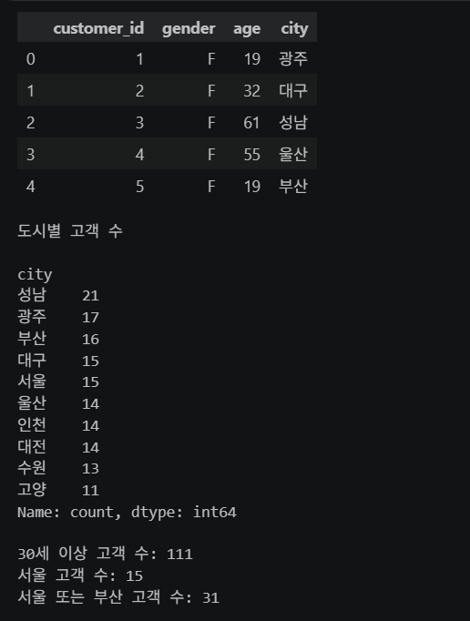
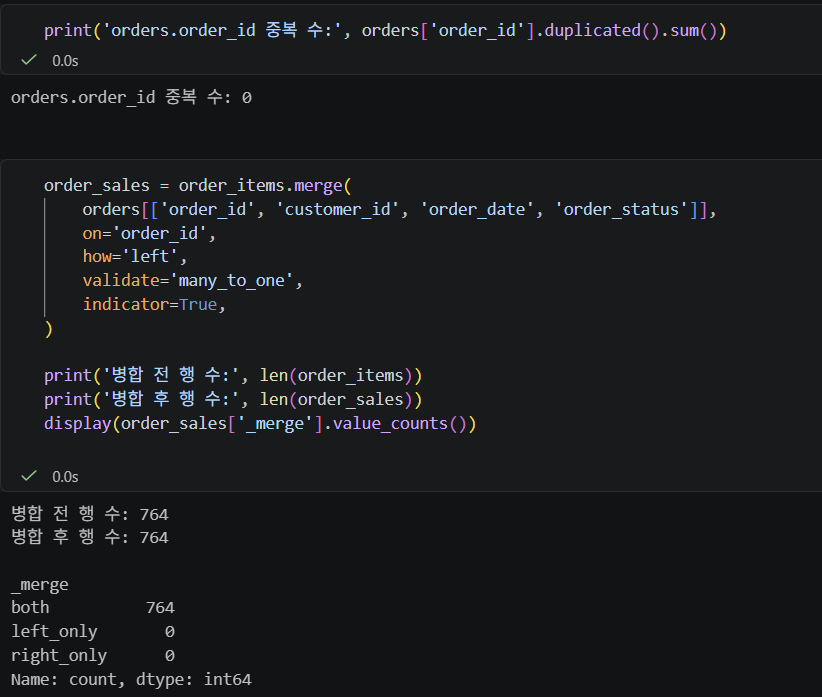
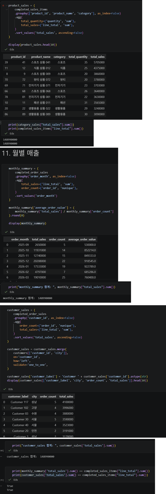
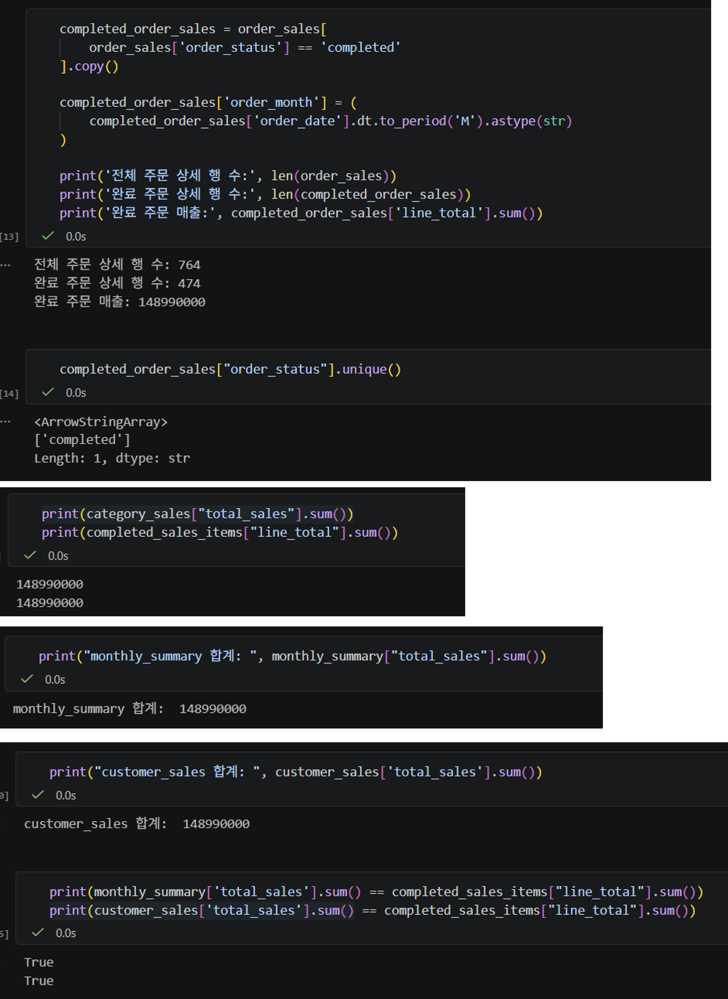
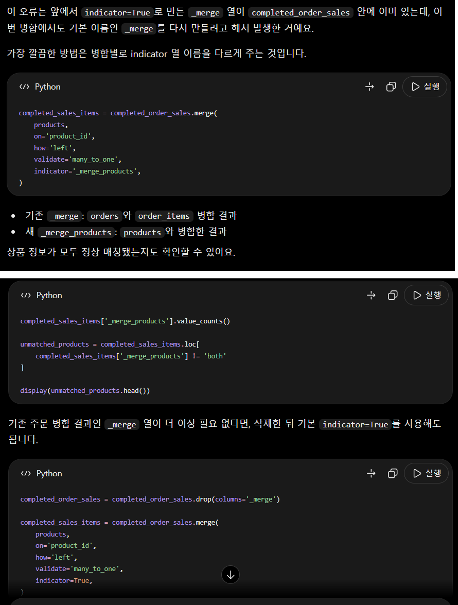

# Chapter 04 제출 답안 양식. pandas로 데이터에 질문하기

> 주 제출물은 실행 완료 Notebook `chapter04/chapter04.ipynb`입니다. 이 양식의 항목을 Notebook의 Markdown 셀로 추가해 작성합니다.

## 0. 제출 정보
- 이름: 전해린
- GitHub ID: Haerin03
- 작성일: 2026.09.28
- 최종 제출 URL: 

## 1. 질문과 필요한 데이터 선택
### 내가 확인하려는 질문

### 사용한 파일/컬럼

### 결과 관찰

### 나의 해석과 판단
왜 이 컬럼과 범위를 선택했는지 작성하세요.

### 업무·분석적 의미

### 한계와 추가 확인 사항

## 2. 필터링·정렬·파생 컬럼
- 적용한 필터 조건: 
* 30세 이상인 고객: customers['age'] >= 30
* 서울에 거주하는 고객: customers['city'] == '서울'
* 서울 또는 부산에 거주하는 고객: customers['city'].isin(['서울', '부산'])
- 정렬 기준: 
* 가격 기준 내림차순: products.sort_values('price', ascending=False)
* 나이 기준 내림차순: customers.sort_values('age', ascending=False)
- 만든 파생 컬럼: 전체 주문 상세 금액 (line_total)
- `line_total` 계산식: order_items['line_total'] = order_items['quantity'] * order_items['unit_price']

### 결과 관찰

### 나의 해석과 판단
필터 기준이 달라지면 결과가 어떻게 달라질지 작성하세요.

### 업무·분석적 의미

### 한계와 추가 확인 사항

## 3. merge 검증
- 병합한 데이터: orders, order_items
- 사용한 key: order_id
- `validate` 결과: 'many_to_one' (order_items에 order_id는 여러 개일 수 있지만, orders에는 하나여야 하기에)
- `indicator` 결과: True
- 병합 전/후 행 수: 병합 전 행 수: 764
병합 후 행 수: 764

### 결과 관찰

### 나의 해석과 판단
이번 병합이 안전하다고 판단한 근거를 작성하세요. 행 수가 증가/감소했다면 이유를 설명하세요.

### 업무·분석적 의미
잘못된 merge가 분석 결과에 어떤 영향을 줄 수 있는지 작성하세요.

### 한계와 추가 확인 사항

## 4. completed 주문 범위와 집계
- 분석 범위 정의: order_sales['order_status'] == 'completed'
- 카테고리별 결과: 	

category	total_quantity	total_sales	sales_ratio
3	스포츠	295	31743000	21.31
5	전자기기	259	26400000	17.72
2	생활용품	272	23915000	16.05
1	뷰티	223	23383000	15.69
4	식품	133	16573000	11.12
0	도서	149	16389000	11.00
6	패션	111	10587000	7.11

- 상품별 결과:

	product_id	product_name	category	total_quantity	total_sales
39	41	스포츠 상품 041	스포츠	35	5705000
11	12	식품 상품 012	식품	25	4375000
8	9	스포츠 상품 009	스포츠	20	3860000
70	72	뷰티 상품 072	뷰티	20	3780000
69	71	전자기기 상품 071	전자기기	23	3703000
66	68	스포츠 상품 068	스포츠	26	3640000
78	81	전자기기 상품 081	전자기기	22	3630000
10	11	패션 상품 011	패션	31	3565000
20	22	생활용품 상품 022	생활용품	29	3248000
86	89	생활용품 상품 089	생활용품	30	3090000

- 월별 결과:

	order_month	total_sales	order_count	average_order_value
0	2025-09	2650000	5	530000.0
1	2025-10	11931000	14	852214.0
2	2025-11	12740000	15	849333.0
3	2025-12	20208000	22	918545.0
4	2026-01	17533000	19	922789.0
5	2026-02	4797000	7	685286.0
6	2026-03	19010000	25	760400.0
7	2026-04	10490000	16	655625.0
8	2026-05	12551000	16	784438.0
9	2026-06	16593000	19	873316.0

- 고객별 결과:

	customer_label	city	order_count	total_sales
0	Customer 117	성남	5	4100000
1	Customer 102	고양	4	3996000
2	Customer 83	수원	4	3880000
3	Customer 30	서울	5	3590000
4	Customer 40	서울	4	3523000
5	Customer 20	인천	2	3191000
6	Customer 3	성남	2	3178000
7	Customer 111	광주	3	3153000
8	Customer 66	서울	4	3093000
9	Customer 147	부산	2	2990000

### 결과 관찰
수치에서 직접 확인한 상위/하위 또는 변화 패턴을 작성하세요.

### 나의 해석과 판단
어떤 결과가 가장 중요하다고 판단했는지와 이유를 작성하세요.

### 업무·분석적 의미
다음 의사결정/분석으로 어떻게 연결할지 작성하세요.

### 한계와 추가 확인 사항
`total_sales`가 회계상 순매출과 같다고 단정할 수 없는 이유를 포함하세요.

## 5. 총합 일치 검증
- 원본 completed `line_total` 합계: 148990000
- 카테고리 합계: 148990000
- 월별 합계: 148990000
- 고객별 합계: 148990000
- 차이 여부: 없음

### 나의 해석과 판단
총합 검증이 필요한 이유와 불일치 시 확인할 순서를 작성하세요.

## 6. LLM pandas 코드 검증
- LLM Prompt 요약:
- 제안 코드 요약:
- 실제 컬럼/범위와 맞지 않은 부분:
- 수정한 내용:
- 최종 판단: 사용 / 수정 후 사용 / 보류

### 나의 해석과 판단
LLM 코드가 실행되었다는 것만으로 분석이 맞다고 볼 수 없는 이유를 작성하세요.

## 7. Chapter 04 최종 인사이트
### 가장 의미 있다고 생각한 결과 2가지
1.
2.

### 그 결과를 뒷받침하는 수치/표

### 추가로 확인하고 싶은 질문

### 현재 결과의 한계

## 최종 제출 체크
- [ ] 핵심 셀 Output이 남아 있습니다.
- [ ] merge와 총합 검증 Evidence가 있습니다.
- [ ] 결과 관찰과 해석이 구분되어 있습니다.
- [ ] LLM 코드를 검증했습니다.
- [ ] 개인정보/Secret이 없습니다.
- [ ] `chapter04/chapter04.ipynb`가 GitHub에서 정상 표시됩니다.
- [ ] 최종 Notebook 파일 URL을 제출합니다.