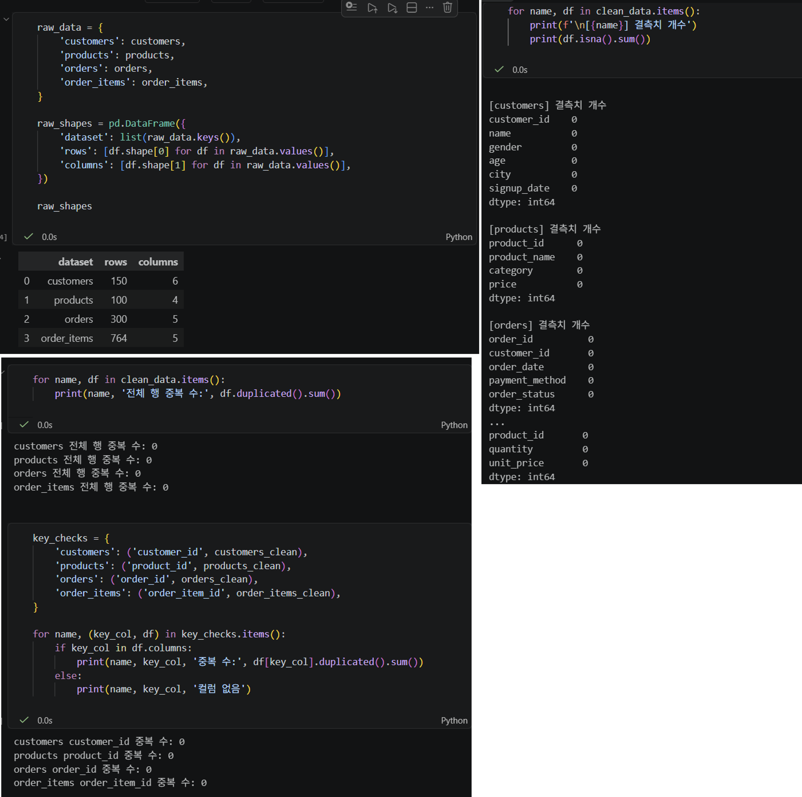
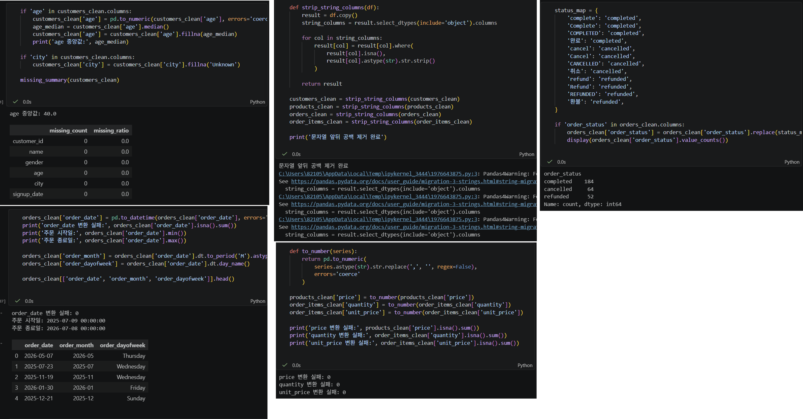
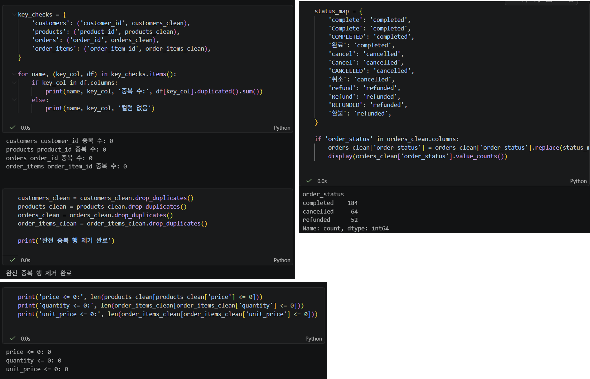
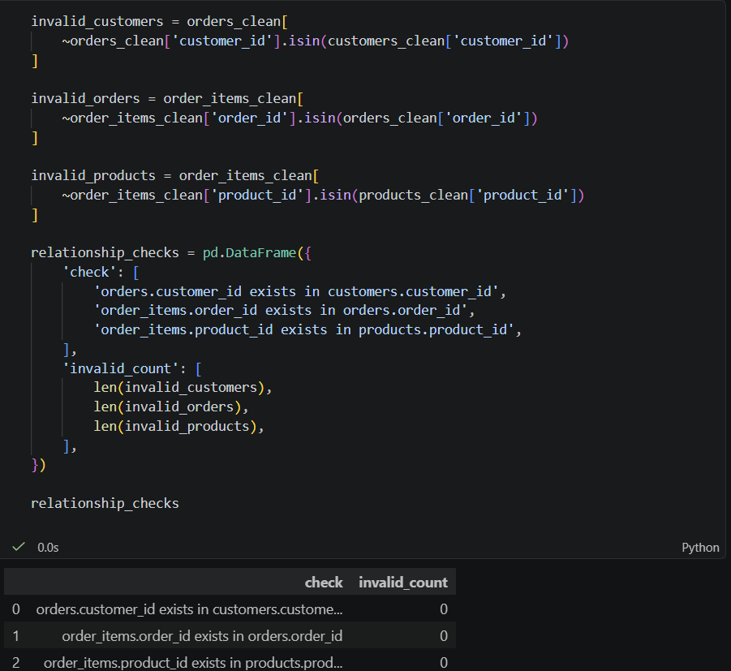
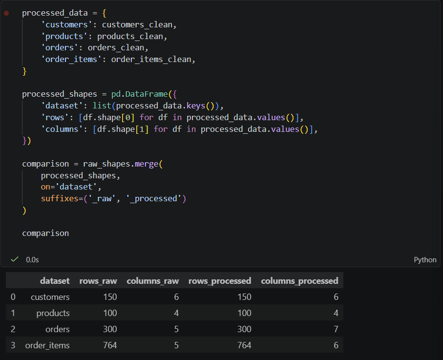
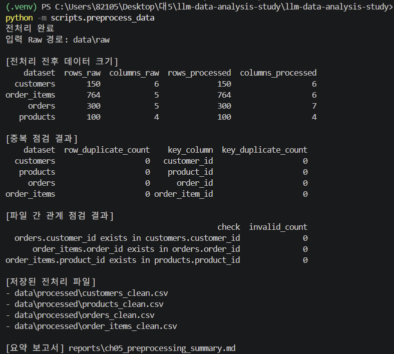

# Chapter 05 제출 답안 양식. 분석을 믿을 수 있게 만드는 데이터 전처리

> 주 제출물은 실행 완료 Notebook `chapter05/chapter05.ipynb`입니다. 이 양식의 항목을 Notebook의 Markdown 셀로 추가해 작성합니다.

## 0. 제출 정보
- 이름: 전해린 
- GitHub ID: Haerin03
- 작성일: 2026.10.07
- 최종 제출 URL: https://github.com/Haerin03/llm-data-analysis-study/blob/main/chapter05/chapter05.ipynb

## 1. 전처리 전 상태 기록
- 각 데이터 shape: 
```text
customers: (150, 6)
products: (100, 4)
orders: (300, 5)
order_items: (764, 5)
```
- 결측치: 
```text
[customers] 결측치 개수
customer_id    0
name           0
gender         0
age            0
city           0
signup_date    0
dtype: int64

[products] 결측치 개수
product_id      0
product_name    0
category        0
price           0
dtype: int64

[orders] 결측치 개수
order_id          0
customer_id       0
order_date        0
payment_method    0
order_status      0
dtype: int64

[order_items] 결측치 개수
order_item_id    0
order_id         0
product_id       0
quantity         0
unit_price       0
dtype: int64
```
- 전체 중복: 
```text
customers 전체 행 중복 수: 0
products 전체 행 중복 수: 0
orders 전체 행 중복 수: 0
order_items 전체 행 중복 수: 0
```
- 주요 ID 중복: 
```text
customers customer_id 중복 수: 0
products product_id 중복 수: 0
orders order_id 중복 수: 0
order_items order_item_id 중복 수: 0
```
- 타입 문제 후보: 
```text
문자열: 앞뒤 공백 제거, 같은 의미의 문자열 같은 표기로 통일
날짜 칼럼: 날짜형으로 변환
숫자 칼럼: 가격, 수량, 단가 등의 칼럼 숫자형으로 변환
```



### 결과 관찰

customers 150행, products 100행, orders 300행, order_items 764행으로 구성되어 있었다. 각 데이터셋의 결측치를 확인한 결과 모든 칼럼의 결측치가 0건이었으며, 전체 행 기준 중복과 customer_id, product_id, order_id, order_item_id 등 주요 ID 기준 중복도 발견되지 않았다.

따라서 현재 데이터에서는 결측치와 중복으로 인한 직접적인 데이터 손실 문제는 확인되지 않았다. 다만 문자열의 앞뒤 공백이나 동일한 의미를 가진 범주값의 표기 차이, 날짜 및 숫자 칼럼의 데이터 타입과 같이 단순 결측치 및 중복 검사만으로 확인하기 어려운 문제는 추가적인 전처리가 필요하다고 판단하였다.

### 나의 해석과 판단
어떤 문제를 먼저 처리해야 하는지와 이유를 작성하세요.

결측치나 중복을 바로 제거하기보다는 먼저 문자열과 데이터 타입을 정리하고, 변환 과정에서 새롭게 발생하는 결측이나 변환 실패가 있는지를 확인하는 것이 중요하다고 판단하였다.

특히 주문 상태처럼 동일한 의미가 여러 문자열로 표현되어 있으면 이후 범주별 집계 결과가 분산될 수 있으므로 표기를 통일할 필요가 있다. 또한 가격, 수량, 단가와 같은 수치형 데이터와 주문일자 및 가입일자와 같은 날짜 데이터는 분석에 적절한 타입으로 변환한 뒤 변환 실패 여부를 확인하는 순서로 처리하고자 하였다.

### 업무·분석적 의미

전처리 전 데이터 상태를 기록하면 이후 분석 결과가 원본 데이터의 특성 때문인지 전처리 과정에서 발생한 변화 때문인지 구분할 수 있다. 또한 전처리 전후의 행 수, 결측치, 중복 등을 비교할 수 있어 데이터가 의도하지 않게 삭제되거나 변경되지 않았는지 확인하는 기준이 된다.

### 한계와 추가 확인 사항

결측치와 중복이 0건이라는 사실만으로 데이터 품질이 완전히 확보되었다고 판단할 수는 없다. 문자열 내부의 표기 차이, 잘못된 날짜나 숫자 값, 현실적으로 가능한 범위를 벗어난 값 등은 별도로 확인해야 한다. 또한 실제 업무 데이터라면 원본 시스템의 입력 규칙과 수집 과정도 함께 확인할 필요가 있다.

## 2. 문자열·타입·결측 처리
- 적용한 문자열 정리: 문자열 앞뒤 공백 제거, 주문 상태값 통일
- 숫자 변환 대상과 실패 건수: price, quantity, unit_price
```text
price 변환 실패: 0
quantity 변환 실패: 0
unit_price 변환 실패: 0
```
- 날짜 변환 대상과 실패 건수: order_date, signup_date 
```text
order_date 변환 실패: 0
signup_date 변환 실패: 0
```
- 결측 처리 기준: 나이와 같은 숫자형 칼럼은 중앙값으로 대체, 도시와 같은 범주형 칼럼은 Unknown으로 대체



### 결과 관찰

문자열 칼럼의 앞뒤 공백을 제거하고 주문 상태값의 표현을 통일하였다. price, quantity, unit_price를 숫자형으로 변환한 결과 변환 실패는 발생하지 않았으며, order_date와 signup_date의 날짜형 변환에서도 실패가 발생하지 않았다.

결측치 처리 기준으로 숫자형인 age는 중앙값으로 대체하고, 범주형인 city는 결측 여부를 명확하게 구분할 수 있도록 'Unknown'으로 대체하도록 구성하였다.

### 나의 해석과 판단
왜 해당 처리 방식을 선택했는지 작성하세요. 삭제/대체가 정보 손실을 만들 가능성도 설명하세요.

age의 경우 평균보다 이상값의 영향을 적게 받는 중앙값을 사용하여 결측치를 대체하도록 하였다. city와 같은 범주형 변수는 임의의 특정 도시로 대체할 경우 잘못된 정보를 만들 수 있으므로 'Unknown'이라는 별도 범주를 사용하는 것이 적절하다고 판단하였다.

다만 결측값 대체는 실제 관측값을 복원하는 것이 아니라 분석을 위한 가정을 추가하는 과정이다. 따라서 결측치가 많을 경우 중앙값이나 Unknown으로 일괄 대체하면 원래 데이터의 분포와 범주 비율이 달라질 수 있다. 실제 업무에서는 결측 발생 원인을 먼저 확인한 뒤 삭제 또는 대체 여부를 결정할 필요가 있다.

### 업무·분석적 의미

데이터 타입과 문자열 표현을 통일하면 이후 집계와 계산 과정에서 발생할 수 있는 오류를 줄일 수 있다. 특히 숫자형 변환은 매출 및 주문 금액 계산에 필요하고, 날짜형 변환은 월별 주문량이나 요일별 주문 패턴과 같은 시계열 분석을 가능하게 한다. 범주값 표준화는 같은 의미의 데이터가 서로 다른 범주로 집계되는 문제를 방지한다.

### 한계와 추가 확인 사항

현재 데이터에서는 숫자 및 날짜 변환 실패가 발견되지 않았기 때문에 변환 로직이 다양한 오류 데이터를 모두 처리할 수 있다고 단정할 수 없다. 또한 중앙값 및 Unknown 대체 방식은 실습을 위한 기준이며, 실제 업무에서는 결측 발생 원인과 데이터 수집 규칙을 확인한 뒤 적절한 처리 방법을 결정해야 한다.

## 3. 중복·범주 표준화·이상값 후보
- 제거/보류한 중복: customer_id, product_id, order_id, order_item_id 등 주요 키의 중복을 기준으로 판단한 완전 중복 행 제거
- 표준화한 범주값: 주문 상태값이 산발적으로 표현되어 있다면 서로 같은 상태로 집계할 수 없기 때문에 대표 표기로 통일함
```text
status_map = {
    'complete': 'completed',
    'Complete': 'completed',
    'COMPLETED': 'completed',
    '완료': 'completed',
    'cancel': 'cancelled',
    'Cancel': 'cancelled',
    'CANCELLED': 'cancelled',
    '취소': 'cancelled',
    'refund': 'refunded',
    'Refund': 'refunded',
    'REFUNDED': 'refunded',
    '환불': 'refunded',
}
```
- 허용값 밖 값: 
```text
price가 음수인 상품
주문 상태값이 completed, cancelled, refunded 이외의 다른 값인 주문 
unit_price가 음수인 주문 상세 
```
- 이상값 후보:
```text
price가 0 이하인 상품
quantity가 0 이하인 주문 상세
unit_price가 0 이하인 주문 상세 
```



### 결과 관찰

전체 행 중복과 주요 ID 기준 중복을 확인한 결과 모든 데이터셋에서 중복이 0건으로 확인되었다. 주문 상태값은 completed, cancelled, refunded를 기준으로 같은 의미의 다양한 표현을 하나의 값으로 통일하도록 하였다.

또한 price, quantity, unit_price가 0 이하인 경우를 정상적인 분석 대상에서 제외하도록 전처리 기준을 설정하였다. 이를 통해 이후 금액 및 주문량 계산에 부적절한 값이 포함되는 것을 방지하였다.

### 나의 해석과 판단
이상값을 자동 삭제하지 않고 후보로 검토해야 하는 이유를 작성하세요.

이상값은 단순히 값이 크거나 작다는 이유만으로 자동 삭제해서는 안 된다고 판단하였다. 실제 업무에서는 0원 상품, 무료 증정품, 반품이나 정정 거래 등 일반적인 범위를 벗어나더라도 업무적으로 의미가 있는 값이 존재할 수 있기 때문이다.

따라서 이상값은 먼저 후보로 식별한 뒤 해당 값이 입력 오류인지 실제 업무에서 발생 가능한 값인지 확인하고 처리 여부를 결정하는 것이 안전하다. 이번 실습에서는 price, quantity, unit_price가 0 이하인 경우를 정상 분석 대상에서 제외하는 명시적인 기준을 적용하였다.

### 업무·분석적 의미

범주값을 표준화하면 동일한 주문 상태가 여러 범주로 분리되어 집계되는 문제를 방지할 수 있다. 또한 가격, 수량, 단가의 비정상적인 값을 관리하면 매출 합계나 평균 주문 금액과 같은 지표가 잘못 계산될 가능성을 줄일 수 있다.

### 한계와 추가 확인 사항

현재 적용한 0 이하 값 제외 기준이 모든 실제 업무 상황에서 적절하다고 볼 수는 없다. 실제 데이터에서는 무료 상품이나 반품 거래처럼 0 또는 음수 값이 의미를 가질 가능성이 있으므로 업무 규칙을 추가로 확인해야 한다. 주문 상태 역시 현재 정의한 세 가지 상태 외에 정상적인 다른 상태가 존재할 가능성을 확인할 필요가 있다.

## 4. PK/FK와 파생 컬럼 재검증
- 없는 `customer_id`: 0
- 없는 `order_id`: 0
- 없는 `product_id`: 0
```text
index  check	invalid_count
0	orders.customer_id exists in customers.customer_id	0
1	order_items.order_id exists in orders.order_id	0
2	order_items.product_id exists in products.product_id	0
```
- 생성한 파생 컬럼:
```text
order_items_clean['line_total'] = (
    order_items_clean['quantity'] * order_items_clean['unit_price']
)
```
- `line_total` 검증: 전처리 후 주문 상세 금액 합계: 255610000

변환 전 quantity, unit_price의 숫자형 변환 후 변환 실패를 확인 후 계산
```text
order_items_clean["quantity"] = pd.to_numeric(
    order_items_clean["quantity"],
    errors="coerce")

order_items_clean["unit_price"] = pd.to_numeric(
    order_items_clean["unit_price"],
    errors="coerce")

print("quantity 결측/변환 실패:", order_items_clean["quantity"].isna().sum())

print("unit_price 결측/변환 실패:", order_items_clean["unit_price"].isna().sum())
```



### 결과 관찰

전처리 후 PK/FK 관계를 다시 확인한 결과 orders의 customer_id, order_items의 order_id, order_items의 product_id에서 참조 대상이 존재하지 않는 경우는 모두 0건이었다. 따라서 전처리 이후에도 데이터셋 간 참조 관계가 유지되고 있음을 확인하였다.

또한 quantity와 unit_price를 숫자형으로 변환한 후 line_total을 계산하였으며, 전처리된 주문 상세 데이터의 line_total 합계는 255,610,000으로 확인되었다.

### 나의 해석과 판단
전처리 후 관계를 다시 검증해야 하는 이유를 작성하세요.

전처리 과정에서 행을 제거하거나 ID 값이 변경되면 기존에 정상적이었던 데이터셋 간 관계가 깨질 수 있기 때문에 전처리 후 PK/FK 관계를 다시 검증해야 한다.
예를 들어 customers에서 특정 고객을 제거했지만 해당 고객의 주문이 orders에 남아 있다면 고객 정보와 주문 정보를 정상적으로 연결할 수 없다. 따라서 전처리가 완료된 데이터만을 대상으로 관계 검증을 다시 수행하는 것이 필요하다고 판단하였다.

또한 line_total은 기존 데이터가 아니라 quantity와 unit_price를 이용해 생성한 값이므로 두 원본 칼럼의 숫자형 변환 성공 여부를 확인한 후 계산해야 신뢰할 수 있다.

## 5. 전처리 전/후 비교
| 항목 | 처리 전 | 처리 후 | 변화 이유 |
| --- | ---: | ---: | --- |
| 행 수 | 150, 100, 300, 764 | 150, 100, 300, 764 | 제거 대상 행이 없어 기존 행 수가 유지됨 |
| 결측 | 0 | 0 | 확인된 결측치가 없어 건수 변화 없음 |
| 중복 | 0 | 0 | 전체 행 및 주요 ID 기준 중복이 발견되지 않음 |
| 변환 실패 | 0 | 0 | 숫자 및 날짜 변환 과정에서 실패가 발생하지 않음 |



### 결과 관찰

전처리 전후를 비교한 결과 네 데이터셋 모두 행 수가 동일하게 유지되었다. 결측치와 중복 역시 전처리 전후 모두 0건이었으며 숫자 및 날짜 변환 과정에서도 실패가 발생하지 않았다.

다만 orders에는 order_month와 order_dayofweek가 추가되어 칼럼 수가 5개에서 7개로 증가하였고, order_items에는 line_total이 추가되어 5개에서 6개로 증가하였다. 이는 데이터 손실이 아니라 분석을 위한 파생 컬럼 생성에 따른 변화이다.

### 나의 해석과 판단
행 수나 값 분포 변화가 의도한 결과인지 판단한 근거를 작성하세요.

전처리 전후 행 수가 동일하다는 점에서 이번 데이터에서는 전처리 규칙에 의해 제거된 행이 없음을 확인할 수 있다. 또한 결측, 중복 및 변환 실패가 발생하지 않았으므로 원본 관측치를 불필요하게 삭제하지 않고 필요한 타입 및 표현 정리와 파생변수 생성을 수행한 것으로 판단하였다.

칼럼 수의 증가는 order_month, order_dayofweek, line_total과 같은 분석 목적의 파생변수를 생성한 결과이므로 의도한 변화라고 판단하였다.

### 업무·분석적 의미

전처리 전후의 데이터 크기와 품질 지표를 비교하면 전처리 과정에서 데이터가 예상과 다르게 손실되었는지 확인할 수 있다. 이번 결과에서는 행 수를 유지하면서 분석에 필요한 날짜 및 금액 관련 파생변수를 추가하였기 때문에 이후 월별 주문 분석, 요일별 주문 분석, 주문 금액 분석에 활용할 수 있는 형태로 데이터가 정리되었다.

### 한계와 추가 확인 사항

행 수와 결측치 수가 동일하다는 것만으로 모든 값이 올바르게 처리되었다고 판단할 수는 없다. 전처리 과정에서 범주값이 의도한 형태로 표준화되었는지, 파생변수가 정확하게 계산되었는지, 값의 분포가 비정상적으로 변하지 않았는지 등을 EDA 단계에서 추가로 확인할 필요가 있다.


## 6. 재현 가능한 전처리 확인
- 생성된 clean CSV:
```text
  - `data/processed/customers_clean.csv`
  - `data/processed/products_clean.csv`
  - `data/processed/orders_clean.csv`
  - `data/processed/order_items_clean.csv`
```
- 생성된 요약 보고서: reports/ch05_preprocessing_summary.md
- `python scripts/preprocess_data.py` 재실행 결과:
```text
  - 오류 없이 `전처리 완료` 메시지가 출력되었다.
  - 전처리된 4개의 CSV 파일과 요약 보고서가 정상적으로 생성되었다.
  - 전처리 전후 행 수, 중복 여부, PK/FK 관계 검증 결과가 함께 출력되었다.
```
- 재실행 후 달라진 점: 동일한 Raw 데이터를 사용하여 다시 실행했을 때 행 수, 중복 점검, 관계 점검 결과가 동일하게 재현되었다. 기존 Raw 데이터는 수정하지 않고 data/processed에 전처리 결과를 다시 생성하므로 원본 데이터는 유지되었다.



### 나의 해석과 판단
Notebook에서 한 번 성공하는 것과 스크립트로 재현 가능한 것의 차이를 작성하세요.

Notebook에서 한 번 전처리에 성공하는 것만으로는 동일한 결과가 다시 만들어진다는 것을 보장하기 어렵다. Notebook은 셀의 실행 순서나 이전 실행 결과에 따라 상태가 달라질 수 있기 때문이다.

반면 전처리 과정을 preprocess_data.py와 같은 스크립트로 구성하면 동일한 Raw 데이터에 동일한 전처리 규칙을 순서대로 적용할 수 있다. 따라서 다른 환경이나 이후 시점에서도 같은 명령으로 전처리 결과를 다시 생성하고 검증할 수 있다는 장점이 있다.

이번 실습에서는 전처리 결과 파일뿐 아니라 전처리 전후 크기, 중복 점검, 데이터 간 관계 점검 결과와 요약 보고서까지 함께 생성하도록 하여 전처리 과정의 재현성과 확인 가능성을 높였다.

## 7. Chapter 05 최종 판단
### 내가 정한 전처리 원칙 3가지
1. Raw 데이터는 직접 수정하지 않고 복사본을 만들어 전처리하며, 처리 전후 결과를 비교한다.
2. 결측치, 중복, 이상값을 발견했다고 바로 삭제하지 않고 데이터의 의미와 업무 규칙을 확인한 뒤 처리 기준을 정한다.
3. 문자열, 숫자, 날짜 등의 타입을 정리한 뒤 변환 실패 여부와 PK/FK 관계를 다시 검증하여 전처리 과정에서 새로운 문제가 발생하지 않았는지 확인한다.

### 가장 위험하다고 생각한 자동 처리 1가지와 이유

가장 위험하다고 생각한 자동 처리는 이상값을 조건만으로 자동 삭제하는 것이다. 예를 들어 가격이나 수량이 0 이하라는 이유만으로 행을 삭제하면 실제 업무에서는 무료 상품, 반품, 취소 또는 데이터 정정과 같이 의미가 있는 거래를 제거할 가능성이 있다. 따라서 이상값은 우선 후보로 확인하고 실제 업무 규칙과 원본 데이터의 의미를 확인한 뒤 삭제 여부를 결정해야 한다.

### 다음 EDA에서 특히 주의할 데이터 특성

다음 EDA에서는 주문 상태별 데이터 분포와 월별·요일별 주문량의 차이를 확인하고, 특정 상품이나 고객에 주문이 과도하게 집중되어 있는지 살펴볼 필요가 있다. 또한 quantity, unit_price, line_total과 같은 수치형 변수에서 극단값이 존재하는지 확인하여 평균이나 총액이 일부 큰 값에 의해 과도하게 영향을 받는지도 검토할 필요가 있다.

### 현재 전처리의 한계

현재 전처리는 실습 데이터에 맞추어 정의한 규칙이므로 실제 업무 데이터에 그대로 적용하기에는 한계가 있다. 결측치를 중앙값이나 Unknown으로 대체하는 기준과 0 이하의 가격·수량·단가를 제외하는 기준은 실제 업무 규칙을 충분히 반영하지 못할 수 있다.

또한 현재 데이터에서 변환 실패나 PK/FK 문제가 발견되지 않았기 때문에 다양한 오류 상황에서 전처리 코드가 적절하게 동작하는지는 추가적인 검증이 필요하다. 실제 업무에서는 원본 시스템의 입력 규칙, 데이터 수집 과정, 담당자의 업무 지식을 함께 확인하여 전처리 기준을 보완해야 한다.

## 최종 제출 체크
- [O] raw 원본을 덮어쓰지 않았습니다.
- [O] 처리 전/후 비교를 남겼습니다.
- [O] 처리 기준과 이유를 자신의 말로 작성했습니다.
- [O] clean CSV와 재실행 결과를 확인했습니다.
- [O] 개인정보/Secret이 없습니다.
- [O] `chapter05/chapter05.ipynb`가 GitHub에서 정상 표시됩니다.
- [O] 최종 Notebook 파일 URL을 제출합니다.