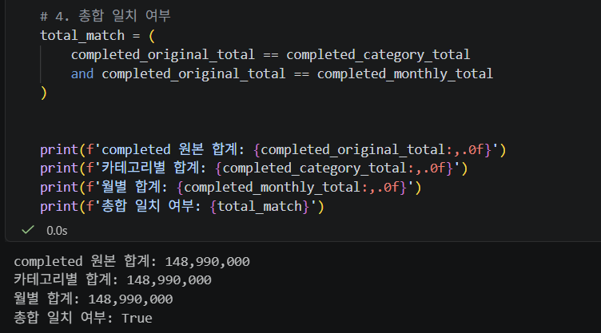
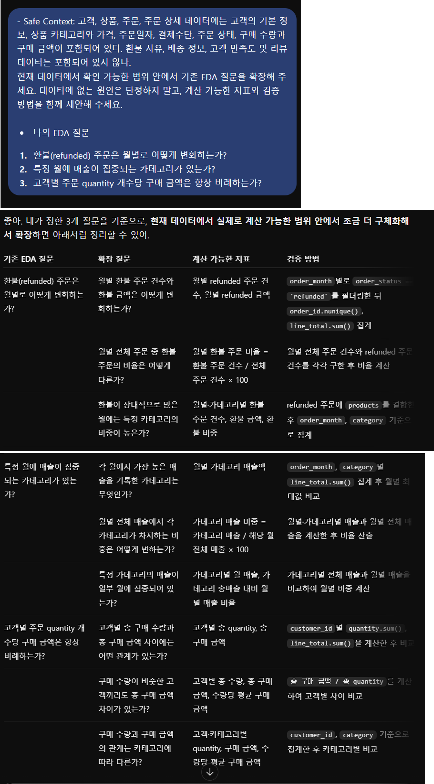

# Chapter 06 답안 양식. 데이터를 보며 질문을 만드는 EDA

> 이 내용을 `chapter06.ipynb`의 Markdown 셀로 작성합니다.

## 제출 정보
- 이름: 전해린
- GitHub ID: Haerin03
- 작성일: 2026.10.11
- 최종 Notebook URL: https://github.com/Haerin03/llm-data-analysis-study/blob/main/chapter06/chapter06.ipynb

## 1. 내가 정한 EDA 질문
| 질문 | 분석 범위 | 지표 | 검증 방법 |
| --- | --- | --- | --- |
| 환불(refunded) 주문은 월별로 어떻게 변화하는가? | 전체 주문 중 order_status='refunded'인 주문을 월별로 분석 | 월별 환불 주문 건수, 월별 환불 금액, 월별 환불 주문 비율 | 월별 환불 주문 건수, 월별 환불 금액, 월별 환불 주문 비율 order_month별 전체 주문 수와 refunded 주문 수를 집계하고 월별 비율 및 금액을 비교 |
| 특정 월에 매출이 집중되는 카테고리가 있는가? | completed 주문을 기준으로 월별·카테고리별 매출 분석 | 월별 카테고리 매출액, 월별 카테고리 매출 비중 | order_month와 category를 기준으로 line_total을 집계한 뒤, 월별 전체 매출에서 각 카테고리가 차지하는 비중 비교 |
| 고객별 주문 quantity 개수당 구매 금액은 항상 비례하는가? | 고객별 전체 구매 내역 | 고객별 총 구매 수량, 총 구매 금액, 수량 1개당 평균 구매 금액 | 고객별 quantity 합계와 line_total 합계를 계산한 후 두 변수의 관계를 비교하고, 구매 수량 대비 구매 금액 차이를 확인 |

### 왜 이 질문을 선택했는가?

단순히 전체 매출 규모만 확인하는 것보다 주문 상태, 시점, 상품 카테고리, 고객의 구매 행동 등 여러 관점에서 데이터를 살펴보는 것이 EDA의 목적에 적합하다고 판단하였다.

첫 번째 질문은 환불 주문이 특정 시기에 증가하거나 감소하는 패턴이 존재하는지 확인하기 위해 선택하였다. 두 번째 질문은 전체 매출만으로는 알기 어려운 월별 카테고리 매출 구조를 확인하기 위해 선택하였다. 세 번째 질문은 구매 수량이 증가하면 구매 금액도 반드시 비례하여 증가하는지 확인하여, 고객별 구매 규모의 차이가 수량에 의한 것인지 상품 가격 차이에도 영향을 받는지 탐색하기 위해 선택하였다.

## 2. 핵심 집계 결과
- completed 원본 합계: 148,990,000
- 카테고리별 합계: 148,990,000
- 월별 합계: 148,990,000
- 총합 일치 여부: True

### 결과 관찰

completed 주문의 원본 매출 합계는 148,990,000원이었으며, 동일한 데이터를 카테고리별로 집계한 후 다시 합산한 결과와 월별로 집계한 후 다시 합산한 결과 역시 모두 148,990,000원으로 동일하게 나타났다.

따라서 카테고리별 집계와 월별 집계 과정에서 매출 금액이 누락되거나 중복 계산되지 않았음을 확인할 수 있었다. 또한 서로 다른 기준으로 데이터를 집계하더라도 전체 매출 총액이 일관되게 유지되었다.

### 나의 해석과 판단

집계 기준을 변경했음에도 전체 합계가 일치한다는 점에서 데이터 병합과 그룹 집계 과정이 정상적으로 수행되었다고 판단하였다.

특히 orders, order_items, products를 결합하는 과정에서는 한 주문에 여러 상품이 존재하기 때문에 행 수가 증가할 수 있다. 하지만 매출 총액 검증 결과가 원본과 동일하게 나타났으므로 이번 분석에서 사용한 line_total 기준의 매출 집계에는 큰 문제가 없는 것으로 볼 수 있다.

다만 총합이 일치한다는 사실만으로 개별 행의 모든 데이터가 정확하다고 단정할 수는 없기 때문에 결측치, 중복값, 잘못된 상품 연결 여부 등은 별도로 확인할 필요가 있다.

### 업무·분석적 의미

카테고리별 또는 월별 분석을 수행하기 전에 전체 매출 합계가 원본 데이터와 일치하는지 확인함으로써 이후의 EDA 결과에 대한 신뢰도를 높일 수 있었다.

또한 전체 매출을 월, 카테고리, 고객 등 여러 기준으로 나누어 분석하더라도 동일한 기준의 매출 데이터가 사용되고 있음을 확인하였기 때문에 이후 카테고리별 매출 비교나 월별 매출 추이 분석을 보다 안정적으로 진행할 수 있다.

### 한계와 추가 확인 사항

현재 검증은 completed 주문의 총매출 합계를 기준으로 수행하였다. 따라서 총액의 일치 여부는 확인할 수 있지만, 개별 주문이나 상품 단위에서 잘못 연결된 데이터가 있는지까지 확인할 수는 없다.

추가로 다음 사항을 확인할 필요가 있다.
- order_id, product_id, customer_id 병합 과정에서 누락된 값이 존재하는지 확인
- line_total = quantity × unit_price가 모든 데이터에서 성립하는지 확인
- 동일한 주문 또는 주문 상품 데이터가 중복으로 포함되어 있지 않은지 확인
- completed, refunded, cancelled 등 주문 상태에 따라 매출 분석 기준을 명확히 구분
- 월별 매출 차이가 실제 주문 건수 차이 때문인지 평균 주문 금액 차이 때문인지 추가 분석

## 3. 관찰 → 가설 → 추가 검증
### 사례 1
- 관찰: 월별로 refunded 주문 건수와 환불 금액에 차이가 나타날 수 있다.
- 가설: 특정 월의 환불 비율이 상대적으로 높다면 해당 월에 특정 상품 또는 카테고리의 환불 주문이 집중되어 있을 가능성이 있다.
- 추가 검증: 월별 전체 주문 대비 환불 주문 비율을 계산하고, 환불이 많은 월을 대상으로 카테고리별·상품별 refunded 주문 건수와 금액을 추가로 비교한다.

### 사례 2
- 관찰: 월별·카테고리별 매출을 비교하면 같은 카테고리라도 월에 따라 매출 규모와 매출 비중이 다르게 나타날 수 있다.
- 가설: 특정 월의 전체 매출이 특정 카테고리의 매출 증가와 함께 높아졌을 가능성이 있다.
- 추가 검증: 각 월의 전체 매출에서 카테고리별 매출이 차지하는 비율을 계산하고, 전월 대비 카테고리별 매출 변화율을 비교한다.

### 사례 3
- 관찰: 고객별 구매 수량이 많더라도 반드시 총 구매 금액이 동일한 비율로 증가한다고 볼 수는 없다.
- 가설: 고객이 구매한 상품의 단가가 서로 다르기 때문에 비슷한 수량을 구매한 고객 사이에서도 총 구매 금액에 차이가 발생할 가능성이 있다.
- 추가 검증: 고객별 총 구매 수량과 총 구매 금액을 함께 비교하고, 고객별 총 구매 금액 ÷ 총 구매 수량을 계산하여 평균 구매 단가의 차이를 확인한다.

## 4. LLM 질문 확장
- Safe Context: 고객, 상품, 주문, 주문 상세 데이터에는 고객의 기본 정보, 상품 카테고리와 가격, 주문일자, 결제수단, 주문 상태, 구매 수량과 구매 금액이 포함되어 있다. 환불 사유, 배송 정보, 고객 만족도 및 리뷰 데이터는 포함되어 있지 않다.
- Prompt: 현재 데이터에서 확인 가능한 범위 안에서 기존 EDA 질문을 확장해 주세요. 데이터에 없는 원인은 단정하지 말고, 계산 가능한 지표와 검증 방법을 함께 제안해 주세요.
- LLM 제안 요약:
1. 월별 환불 주문 건수뿐만 아니라 환불 금액과 전체 주문 대비 환불 비율을 함께 비교하는 질문으로 확장하였다. 또한 환불이 상대적으로 많은 월에 특정 카테고리의 환불 비중이 높은지 추가로 확인하도록 제안하였다.
2. 월별·카테고리별 매출액뿐만 아니라 각 월의 전체 매출에서 카테고리가 차지하는 비율을 계산하고, 특정 카테고리의 매출이 일부 월에 집중되는지 확인하는 질문으로 확장하였다.
3. 고객별 총 구매 수량과 총 구매 금액의 관계를 비교하고, 구매 수량이 비슷한 고객 간에도 구매 금액 차이가 존재하는지 확인하도록 확장하였다. 추가 지표로 고객별 수량당 평균 구매 금액을 활용하도록 제안하였다.
- 실제 사용 여부: 수정 후 사용
- 판단 이유: LLM이 제안한 질문 대부분은 현재 데이터의 order_status, order_month, category, quantity, line_total 등을 이용해 직접 계산할 수 있었다. 다만 환불 증가의 원인이나 특정 월의 매출 증가 원인 등 현재 데이터에 존재하지 않는 정보를 근거로 설명할 수 있는 부분은 제외하였다.
- 사람이 수정한 내용: 원인을 설명하는 표현을 제거하고, 환불 주문 비율, 카테고리별 매출 비중, 고객별 수량당 평균 구매 금액처럼 실제 데이터로 계산할 수 있는 지표 중심으로 질문을 구체화하였다.

## 5. 다음 분석 우선순위
1. 월별 refunded 주문 건수와 환불 비율 분석
2. 월별·카테고리별 매출 비중과 변화 분석
3. 고객별 구매 수량과 총 구매 금액의 관계 분석

### 가장 먼저 확인하고 싶은 이유

가장 먼저 월별 환불 주문의 변화를 확인하고 싶다. 전체 매출만으로는 실제 주문의 안정성을 충분히 판단하기 어렵고, 환불 주문이 특정 시기에 집중되는지 확인하면 이후 카테고리 또는 상품 단위의 추가 분석 대상을 좁힐 수 있기 때문이다.

특정 월의 환불 비율이 다른 월보다 높게 나타난다면 해당 월을 기준으로 카테고리, 상품, 결제수단 등 세부 조건을 추가로 분석할 수 있다. 따라서 월별 환불 분석을 후속 분석의 출발점으로 설정하였다.

### 현재 데이터만으로 단정할 수 없는 것

현재 데이터만으로는 고객이 상품을 환불한 구체적인 이유를 확인할 수 없다. 따라서 환불이 상품 품질, 배송 문제, 단순 변심, 가격 등의 이유로 발생했다고 단정할 수 없다.
또한 특정 카테고리의 월별 매출이 증가하더라도 프로모션, 계절적 요인, 광고, 외부 이벤트 등에 의한 것인지 현재 데이터만으로 확인할 수 없다.
고객별 구매 금액 차이 역시 구매 수량과 상품 가격은 확인할 수 있지만 고객의 선호도, 소득 수준, 구매 목적 등 데이터에 포함되지 않은 요인으로 설명할 수는 없다.
따라서 현재 분석에서는 데이터에서 직접 확인 가능한 패턴을 관찰하고, 원인에 대한 설명은 가설로 제한한 뒤 추가 데이터가 확보될 경우 별도로 검증하는 것이 적절하다.

## 최종 체크
- [O] 질문과 지표가 연결되어 있습니다.
- [O] 집계 총합을 검증했습니다.
- [O] 관찰과 가설을 구분했습니다.
- [O] 다음 검증 질문을 작성했습니다.
- [O] LLM 제안을 검증했습니다.
- [O] 최종 Notebook URL을 제출합니다.